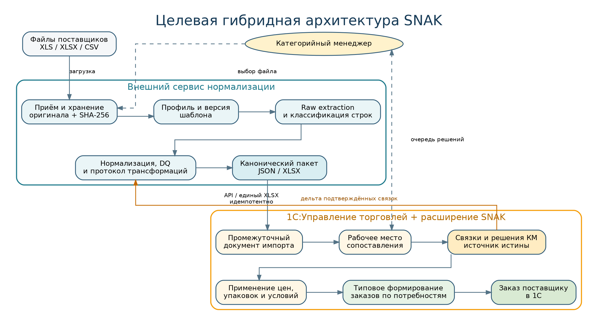
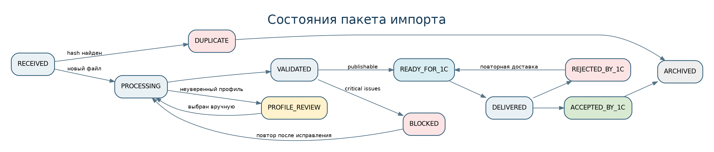

::: {custom-style="DocKicker"}
SNAX · АВТОМАТИЗАЦИЯ ЗАКАЗОВ ПОСТАВЩИКАМ
:::

::: {custom-style="DocTitle"}
ФУНКЦИОНАЛЬНО-ТЕХНИЧЕСКАЯ СПЕЦИФИКАЦИЯ
:::

::: {custom-style="DocSubtitle"}
Спецификация реализации гибридной подсистемы нормализации файлов и интеграции с 1С:Управление торговлей — рабочий контракт для Codex и команды разработки
:::

::: {custom-style="DocVersion"}
Версия 2.0 · 17 августа 2026 года · Статус: baseline для репозитория
:::

| Роль | Ответственность | ФИО / команда |
|---|---|---|
| Product owner | Границы, приоритеты и бизнес-правила |  |
| Tech lead сервиса | Архитектура и качество внешнего сервиса |  |
| Архитектор / разработчик 1С | Расширение и типовые объекты УТ |  |
| QA lead | Golden tests, интеграционная и UAT-приёмка |  |
| DevOps / ИБ | Среды, секреты, мониторинг, резервирование |  |

::: {custom-style="Callout"}
**Назначение.** Документ задаёт технические инварианты, контракты, компоненты, данные, API, объекты расширения 1С, алгоритмы, тестовую стратегию и последовательность задач. Codex должен работать только в рамках этих инвариантов и не принимать самостоятельно бизнес-решения, обозначенные как открытые.
:::

::: {custom-style="Callout"}
**Baseline 2.1.** Технический контур приемки и задачи `TASK-026…TASK-036` определены в [TZ_ADDENDUM_RECEIVING.md](TZ_ADDENDUM_RECEIVING.md) и `tasks/IMPLEMENTATION_BACKLOG.md`. До утверждения открытых решений Codex не должен угадывать маршрут поступления, права и допуски расхождений.
:::

# Содержание

1. Архитектурные решения
2. Технологический стек
3. Структура репозитория
4. Доменные модули
5. Модель данных сервиса
6. Профиль импорта
7. Канонический контракт пакета
8. API сервиса
9. Расширение 1С
10. Алгоритм сопоставления
11. Состояния и переходы
12. Обработка ошибок и повторов
13. Безопасность
14. Наблюдаемость
15. Тестовая стратегия
16. Развёртывание и среды
17. План реализации для Codex
18. Спецификация пилотных профилей
19. Производительность и объёмы
20. Решения, которые Codex не должен угадывать
21. Приёмка технической реализации
22. Документация и эксплуатационные артефакты
23. Критерии изменения спецификации
24. Приложение: команды проверки baseline
25. Итоговый технический baseline

# 1. Архитектурные решения

## 1.1. Контекст

Решение обрабатывает нестабильные файлы поставщиков и переводит их в единый пакет для 1С. Сервис является анти-коррупционным слоем между произвольными Excel/XLS/CSV и стабильной моделью закупок. 1С остаётся источником истины для внутренней номенклатуры, связей, остатков, продаж, потребностей и заказов.

## 1.2. Архитектурные инварианты

Следующие правила обязательны и не могут быть изменены отдельным pull request:

1. **Ни одна строка не теряется молча.** Каждая прочитанная строка классифицирована либо зафиксирована как технически нечитаемая.
2. **Raw-данные неизменяемы.** Повторная обработка создаёт новый processing run.
3. **1С — master для связей.** Сервис хранит только синхронизируемый кэш.
4. **Сервис не рассчитывает потребность и не создаёт заказ поставщику.**
5. **Нет прямого доступа к БД 1С.** Только поддерживаемый API, HTTP-сервис, расширение или файловый контракт пилота.
6. **Excel не исполняется.** Макросы, внешние ссылки и формулы не запускаются.
7. **GTIN — строка и не глобальный уникальный ключ.**
8. **Операции идемпотентны.** File digest, package ID, request ID и mapping version защищают от дублей.
9. **Контракты и профили версионируются.** Breaking change требует новой major-версии.
10. **Fuzzy matching не подтверждает связь.** Он только предлагает кандидатов.
11. **Production-файлы и персональные/коммерческие данные не коммитятся в репозиторий.**
12. **Любой код Codex проходит тесты и человеческое ревью до merge.**

## 1.3. Целевая архитектура

{width=92%}

Внешний сервис строится как **модульный монолит** с фоновой очередью. Это снижает стоимость начальной эксплуатации, но сохраняет границы модулей, позволяющие позднее выделить reader workers или integration gateway.

Расширение 1С изолирует staging и дополнительную модель связей от типовой конфигурации. Изменение типовых объектов выполняется только через штатные программные интерфейсы и после подтверждения пакета.

## 1.4. ADR

Архитектурное решение зафиксировано в `adr/ADR-001-hybrid-architecture.md`. Любая замена на «всё в сервисе» или «всё в 1С» требует нового ADR с анализом стоимости миграции и влияния на типовую поддержку.

# 2. Технологический стек

## 2.1. Сервис

Рекомендуемый baseline:

| Слой | Технология | Комментарий |
|---|---|---|
| Runtime | Python 3.12+ | Строгая типизация, стабильная экосистема чтения таблиц |
| API | FastAPI | OpenAPI, dependency injection, async endpoints |
| Validation | Pydantic 2 | Модели контракта и профиль DSL |
| ORM / migration | SQLAlchemy 2 + Alembic | PostgreSQL, явные транзакции |
| Database | PostgreSQL 16+ | Транзакционные данные, JSONB только для raw/extension полей |
| Queue | Celery-compatible worker + Redis | Допускается Dramatiq/RQ после ADR; интерфейс очереди абстрагирован |
| Object storage | S3-compatible / MinIO | Исходные файлы и крупные артефакты |
| XLSX | openpyxl в `read_only/data_only` режимах | Формулы отдельно от кэшированных значений |
| XLS | специализированный BIFF-reader в изолированном worker | Без офисного приложения и макросов |
| CSV | Python csv / pyarrow по необходимости | Явная кодировка и dialect detection |
| UI | React + TypeScript | shadcn/ui допустим, без бизнес-логики в браузере |
| Tests | pytest, Hypothesis, Playwright | Unit, property, integration, end-to-end |
| Quality | Ruff, mypy/pyright, ESLint, typecheck | Все проверки входят в CI |
| Observability | structured JSON logs, Prometheus, OpenTelemetry | correlation и trace ID |

Изменение ключевой технологии требует ADR. На пилоте допускается SQLite только для локального developer mode; тестовые и производственные среды используют PostgreSQL.

## 2.2. 1С

- расширение конфигурации УТ без снятия типовой конфигурации с поддержки;
- HTTP-сервисы или общий модуль интеграции;
- регламентные задания для polling и обработки очереди;
- управляемые формы рабочего места;
- регистры сведений для расширенных связей, ценовых лестниц и наличия поставщика;
- стандартный механизм обеспечения потребностей и документ «Заказ поставщику»;
- BSL Language Server / статический анализ, где возможно;
- отдельная тестовая информационная база и набор xUnitFor1C/Vanessa Automation либо согласованный эквивалент.

## 2.3. Инфраструктура

Минимальный промышленный контур:

- reverse proxy / ingress;
- API process;
- worker process(es);
- PostgreSQL;
- Redis;
- S3-compatible storage;
- мониторинг и алертинг;
- secret manager или защищённое хранилище переменных;
- резервное копирование БД и object storage;
- сетевой маршрут до 1С либо polling из внутреннего контура.

# 3. Структура репозитория

```text
snax-order-import/
├── AGENTS.md
├── README.md
├── pyproject.toml
├── package.json
├── docker-compose.yml
├── .env.example
├── .github/workflows/
├── docs/
│   ├── TZ.md
│   ├── SPEC.md
│   └── assets/
├── adr/
├── contracts/
│   ├── openapi.yaml
│   ├── schemas/
│   └── examples/
├── profiles/
│   ├── schema/
│   ├── examples/
│   └── suppliers/
├── services/api/
├── services/worker/
├── src/snax_import/
│   ├── domain/
│   ├── application/
│   ├── adapters/
│   ├── api/
│   ├── profiles/
│   ├── readers/
│   ├── normalization/
│   ├── quality/
│   ├── packaging/
│   ├── integration_1c/
│   └── observability/
├── web/
├── onec-extension/
│   ├── src/
│   ├── tests/
│   └── docs/
├── tests/
│   ├── unit/
│   ├── integration/
│   ├── contract/
│   ├── golden/
│   └── e2e/
├── fixtures/synthetic/
├── scripts/
└── tasks/
```

## 3.1. Правила зависимостей

- `domain` не зависит от FastAPI, SQLAlchemy, openpyxl, S3 или 1С.
- `application` зависит от domain и портов, но не от конкретных adapters.
- readers возвращают raw workbook model, а не domain items.
- normalization не читает файлы напрямую.
- integration_1c принимает только canonical package и mapping delta.
- API не содержит долгих вычислений; он ставит задачи и возвращает task ID.
- UI не воспроизводит server-side validation.
- profile DSL не содержит исполняемого Python/JavaScript и не поддерживает `eval`.

# 4. Доменные модули

## 4.1. Ingestion

Ответственность:

- зарегистрировать файл;
- проверить расширение, MIME, размер и digest;
- сохранить оригинал;
- создать import batch;
- инициировать processing run;
- вернуть детерминированный статус дубля.

Не отвечает за распознавание товаров.

## 4.2. Workbook readers

Единый порт:

```python
class WorkbookReader(Protocol):
    def supports(self, media_type: str, extension: str) -> bool: ...
    def read(self, source: BinaryIO, options: ReaderOptions) -> RawWorkbook: ...
```

`RawWorkbook` содержит листы, размеры, видимость, merged ranges, строки/ячейки, формулы, кэшированные значения, отображаемые значения, тип и координаты. Reader обязан применять лимиты, а не загружать бесконечную книгу в память.

## 4.3. Profile engine

Profile engine:

1. вычисляет structural fingerprint;
2. ранжирует подходящие версии профиля;
3. выбирает профиль только при превышении порога и отсутствии неоднозначности;
4. выполняет декларативные правила выбора листов, диапазонов, колонок и типов строк;
5. запрещает публикацию при несовместимой сигнатуре;
6. формирует explain-лог: какое правило сработало и почему.

## 4.4. Normalization

Функции нормализации являются чистыми и тестируемыми:

- `normalize_text`;
- `normalize_supplier_sku`;
- `normalize_gtin`;
- `parse_decimal`;
- `parse_date`;
- `parse_unit`;
- `normalize_availability`;
- `build_packaging_variant`;
- `build_external_variant_key`.

Каждая функция возвращает результат и список transformation events / issues, а не скрывает исправления.

## 4.5. Data quality

DQ engine выполняет:

- completeness checks;
- type and range checks;
- cross-field checks;
- duplicate detection;
- formula error detection;
- profile drift checks;
- referential checks within package;
- blocking policy.

Severity:

- `INFO` — преобразование без риска;
- `WARNING` — строка пригодна, но требует внимания;
- `ERROR` — строка не может применяться;
- `CRITICAL` — пакет не публикуется.

## 4.6. Package builder

Package builder:

- принимает только результат завершённого processing run;
- фиксирует snapshot версий профиля и схемы;
- создаёт manifest и immutable payload;
- считает digest payload;
- разбивает строки на chunks по согласованному размеру;
- публикует outbox event;
- не меняет пакет после публикации.

## 4.7. Mapping cache

Сервис хранит read model подтверждённых 1С-связей. Она используется только для:

- предварительной маркировки уже известных позиций;
- обнаружения изменений внешнего варианта;
- предупреждения о потенциальном конфликте;
- ускорения UI.

Сервис не может изменить статус mapping на `APPROVED` без события из 1С.

# 5. Модель данных сервиса

## 5.1. Основные сущности

| Сущность | Ключевые поля | Назначение |
|---|---|---|
| `supplier` | id, code, name, status | Поставщик и его настройки |
| `supplier_profile` | id, supplier_id, code | Логическая группа профиля |
| `supplier_profile_version` | id, profile_id, version, schema, status, fingerprint | Неизменяемая версия профиля |
| `source_file` | id, sha256, object_key, name, media_type, size | Оригинальный файл |
| `import_batch` | id, supplier_id, source_file_id, status, received_at | Бизнес-загрузка |
| `processing_run` | id, batch_id, profile_version_id, code_version, status | Конкретный запуск обработки |
| `raw_sheet` | id, run_id, name, index, dimensions | Метаданные листа |
| `raw_row` | id, sheet_id, row_no, cells_json, row_hash | Снимок исходной строки |
| `normalized_item` | id, run_id, stable_row_id, external_variant_key, fields | Каноническая товарная строка |
| `item_gtin` | item_id, value, kind, validity, source | GTIN и альтернативные коды |
| `item_packaging` | item_id, unit, base_qty, dimensions | Вариант упаковки |
| `item_price` | item_id, price_type, amount, currency, threshold | Ценовой уровень |
| `item_availability` | item_id, quantity, status, expected_at | Наличие поставщика |
| `import_issue` | run_id, item_id/raw_row_id, code, severity, details | Ошибка или предупреждение |
| `transformation_event` | item_id/raw_cell, rule, before, after | Аудит преобразования |
| `mapping_cache` | supplier_id, external_variant_key, 1c GUIDs, version | Кэш связи из 1С |
| `export_package` | id, run_id, schema_version, payload_digest, status | Опубликованный пакет |
| `delivery_attempt` | package_id, target, try_no, status, response | Попытка доставки/выдачи |
| `outbox_event` | aggregate, event_type, payload, published_at | Транзакционный outbox |
| `audit_event` | actor, action, object_type, object_id, before/after | Пользовательский аудит |

## 5.2. Ограничения БД

- уникальный индекс `source_file.sha256` при политике глобальной дедупликации либо составной индекс с tenant;
- уникальность `(package_id, chunk_no)`;
- уникальность `external_variant_key` только в пределах supplier/profile snapshot, не глобально;
- version mapping монотонна для одного ключа;
- monetary/quantity columns — `NUMERIC`, не float;
- timestamps — timezone-aware;
- soft delete не используется для immutable audit/event rows;
- бизнес-операция и запись outbox выполняются в одной транзакции.

## 5.3. Стабильный идентификатор строки

`stableRowId` строится детерминированно из:

```text
source_file_sha256 + sheet_name + row_number + selected_raw_cell_hash
```

Он обеспечивает трассировку, но не используется как долгосрочный идентификатор товара. Для внешнего товара применяется `externalVariantKey`, зависящий от поставщика, внешних кодов и упаковки.

# 6. Профиль импорта

## 6.1. Требования к DSL

Профиль хранится в YAML/JSON и валидируется JSON Schema. Он содержит только данные и разрешённые операции. Любая новая операция добавляется в parser runtime с тестами и документацией.

Пример:

```yaml
profileVersion: 1.0.0
supplierCode: DEMO
match:
  fileNameRegex: '(?i)demo.*\\.xlsx$'
  requiredSheetNames: [Прайс]
  requiredHeaders: [Артикул, Наименование, Штрихкод]
workbook:
  includeSheets: [Прайс]
  excludeHiddenSheets: false
ranges:
  - sheet: Прайс
    header:
      searchRows: [1, 20]
      aliases:
        supplierSku: [Артикул, Код]
        name: [Наименование, Товар]
        gtin: [Штрихкод, EAN]
        price: [Цена, Опт]
    rows:
      startAfterHeader: 1
      stopWhen:
        allEmpty: true
      classify:
        categoryWhen:
          - column: name
            regex: '^Раздел:'
    mapping:
      supplierSku: supplierSku
      supplierName: name
      gtinRaw: gtin
      prices:
        - type: BASE
          column: price
          currency: RUB
normalization:
  gtin:
    trim: true
    removeLeadingDot: true
    restoreLeadingZeroOnlyIfChecksumValid: true
quality:
  blocking:
    - missing:supplierName
    - invalid:price
```

## 6.2. Версионирование профиля

- опубликованная версия immutable;
- patch — исправление без изменения ожидаемого канонического результата;
- minor — поддержка варианта шаблона и новые необязательные поля;
- major — несовместимое изменение структуры/семантики;
- активация требует прохождения golden tests;
- rollback выполняется переключением active version, но старые run сохраняют свой snapshot.

## 6.3. Structural fingerprint

Fingerprint может включать:

- имена и порядок листов;
- число колонок в кандидатных диапазонах;
- нормализованные значения шапки;
- merged ranges;
- наличие/тип ключевых формул;
- сигнатуру первых N непустых строк;
- workbook metadata, не содержащую персональных данных.

Fingerprint помогает обнаружить drift, но не заменяет semantic validation.

# 7. Канонический контракт пакета

## 7.1. Заголовок

Обязательные поля:

- `schemaVersion`;
- `packageId`;
- `idempotencyKey`;
- `createdAt`;
- `supplier`;
- `sourceFile`;
- `profile`;
- `summary`;
- `rows` либо manifest chunks;
- `issues`;
- `payloadDigest`.

## 7.2. Товарная строка

```json
{
  "rowId": "row_...",
  "source": {"sheet": "Прайс", "row": 137},
  "rowType": "PRODUCT",
  "externalVariantKey": "extv_...",
  "supplierSku": "ET-001259",
  "supplierNameRaw": "...",
  "supplierNameNormalized": "...",
  "brand": "Example",
  "gtins": [
    {"raw": ".460123456789", "normalized": "0460123456789", "valid": true}
  ],
  "packaging": {
    "baseUnit": "PCE",
    "orderUnit": "BOX",
    "baseUnitsPerOrderUnit": "24"
  },
  "prices": [
    {"type": "BASE", "amount": "85.00", "currency": "RUB", "perUnit": "PCE"}
  ],
  "availability": {
    "quantity": "12",
    "unit": "BOX",
    "status": "IN_STOCK",
    "expectedAt": null,
    "supplierComment": null
  },
  "constraints": {
    "moq": "2",
    "multiple": "1",
    "unit": "BOX",
    "minimumOrderAmount": null
  },
  "quality": {"status": "VALID", "issueCodes": []},
  "mappingHint": {"cachedMappingVersion": 17}
}
```

Полная схема находится в `contracts/schemas/import-package.schema.json`.

## 7.3. Представление decimal

Все значения количества и денег передаются строками по regex decimal. Это исключает ошибки binary float и сохраняет точность. Отсутствующее значение — `null`, а не пустая строка или ноль.

## 7.4. Целостность пакета

- `summary.totalRows` равно числу считанных raw rows;
- сумма row type counters согласована с raw rows;
- `summary.productRows` равно числу товарных normalized rows;
- digest рассчитывается по канонически сериализованному payload без поля digest;
- каждый issue ссылается на package, row или raw coordinate;
- 1С проверяет schemaVersion, supplier и digest до импорта.

# 8. API сервиса

## 8.1. Общие правила

- Base path: `/api/v1`.
- Authentication: service token/OIDC в зависимости от решения D-12.
- Content type: `application/json`; upload — `multipart/form-data`.
- Идемпотентные POST принимают `Idempotency-Key`.
- Каждый ответ содержит или отражает `X-Correlation-ID`.
- Ошибка соответствует Problem Details-подобной модели: `code`, `message`, `details`, `field`, `retryable`, `correlationId`.
- Списки используют cursor pagination.
- Долгая операция возвращает `202 Accepted` и ссылку на ресурс статуса.

## 8.2. Операторские endpoints

| Метод и путь | Назначение |
|---|---|
| `POST /imports` | Загрузить файл и создать import batch |
| `GET /imports/{id}` | Получить состояние, счётчики и выбранный профиль |
| `GET /imports/{id}/rows` | Просмотреть нормализованные/служебные строки |
| `GET /imports/{id}/issues` | Просмотреть ошибки и преобразования |
| `POST /imports/{id}/profile` | Подтвердить/заменить версию профиля и запустить новый run |
| `POST /imports/{id}/publish` | Опубликовать валидный результат как пакет |
| `GET /packages/{id}` | Состояние и manifest пакета |
| `GET /packages/{id}/export.xlsx` | Выгрузить единый XLSX для пилота |
| `GET /profiles` | Список профилей и активных версий |
| `POST /profiles/{id}/validate` | Прогнать профиль на synthetic/golden fixture |

## 8.3. Integration endpoints для 1С

| Метод и путь | Назначение |
|---|---|
| `GET /integration/1c/packages/next` | Получить следующий пакет/manifest для конкретной базы или узла |
| `GET /integration/1c/packages/{id}` | Получить заголовок пакета |
| `GET /integration/1c/packages/{id}/rows?cursor=` | Получить chunk строк |
| `GET /integration/1c/packages/{id}/issues?cursor=` | Получить issues |
| `POST /integration/1c/packages/{id}/ack` | Подтвердить приём/отклонение/частичный результат |
| `POST /integration/1c/mappings:sync` | Передать snapshot или дельту подтверждённых связей |
| `GET /integration/1c/mappings/checkpoint` | Получить последнюю принятую версию синхронизации |

## 8.4. Health и эксплуатация

| Путь | Назначение |
|---|---|
| `GET /health/live` | Процесс работает; без внешних зависимостей |
| `GET /health/ready` | БД, object storage и очередь доступны |
| `GET /metrics` | Prometheus metrics, только внутренний доступ |
| `GET /version` | Версия приложения, commit SHA, contract version |

## 8.5. ACK от 1С

```json
{
  "packageId": "8cfd...",
  "status": "ACCEPTED",
  "receivedAt": "2026-08-17T08:15:30Z",
  "onecDocumentGuid": "...",
  "summary": {
    "loadedRows": 475,
    "matchedSaved": 401,
    "reviewRequired": 52,
    "errors": 22
  },
  "error": null,
  "correlationId": "..."
}
```

Допустимые статусы: `ACCEPTED`, `PARTIAL`, `REJECTED`, `RETRY_LATER`. `RETRY_LATER` обязательно содержит `retryAfterSeconds`.

# 9. Расширение 1С

## 9.1. Предлагаемые метаданные

Имена являются рабочими и уточняются по стандартам конкретной базы.

### Документ `SNAXИмпортПрайсЛиста`

Шапка:

- `PackageId`;
- `SchemaVersion`;
- `Поставщик/Партнёр`;
- `Профиль` и `ВерсияПрофиля`;
- `SHA256`;
- `ИмяФайла`;
- `ДатаПрайса`;
- `ДатаПубликации`;
- `СтатусПакета`;
- `СтатусСопоставления`;
- счётчики строк и ошибок;
- `CorrelationId`;
- ссылка/ключ архива исходного файла.

Табличная часть `Позиции`:

- `RowId`;
- лист и строка;
- внешний вариант;
- код, исходное/нормализованное наименование;
- GTIN;
- бренд/вес/объём;
- базовая единица, единица заказа, коэффициент;
- цены и ссылка на расширенные уровни;
- наличие и дата;
- MOQ/кратность;
- номенклатура, характеристика, упаковка 1С;
- статус сопоставления;
- explanation/candidate score;
- issue codes;
- комментарий КМ.

### Регистры сведений

| Регистр | Назначение |
|---|---|
| `SNAXВнешниеПозицииПоставщиков` | Стабильная карточка внешнего варианта и последние реквизиты |
| `SNAXСоответствияНоменклатуры` | Версионированная связь с номенклатурой/характеристикой/упаковкой 1С |
| `SNAXЦеновыеУровниПоставщиков` | Несколько цен, пороги, валюта, период действия, источник |
| `SNAXДоступностьПоставщиков` | Количество, качественный статус, дата ожидания, время снимка |
| `SNAXПакетыИнтеграции` | Идемпотентность, chunk progress, ACK, ошибки |
| `SNAXИсторияРешенийКМ` | Действия, причины и предыдущие значения, если стандартного журнала недостаточно |

### Перечисления

- `SNAXСтатусПакета`;
- `SNAXСтатусСопоставления`;
- `SNAXСтатусНаличияПоставщика`;
- `SNAXSeverityОшибки`;
- `SNAXТипЦеныПоставщика`.

### Общие модули и регламентные задания

- клиент API сервиса;
- загрузчик manifest/chunks;
- валидатор контракта;
- matching engine;
- применение подтверждённых данных;
- экспорт mapping delta;
- polling готовых пакетов;
- retry/cleanup/archiving;
- мониторинг зависших пакетов.

## 9.2. Рабочее место КМ

Форма должна поддерживать серверную выборку и пакетную работу. Обязательные представления:

- «Готово автоматически»;
- «Требует подтверждения»;
- «Несколько кандидатов»;
- «Новинки»;
- «Конфликт упаковки»;
- «Не в ассортименте»;
- «Не работаем»;
- «Ошибки данных»;
- «Изменения ранее связанной позиции».

Для производительности не следует загружать все 100–300 тысяч строк в клиент. Используются фильтры, пагинация/динамический список, серверные команды и фоновые задания.

## 9.3. Применение к типовым объектам

Команда «Применить подтверждённые данные» выполняется транзакционно по контролируемым порциям. Алгоритм:

1. проверить статус пакета и отсутствие критических ошибок;
2. проверить, что каждая применяемая строка имеет действующую связь и совместимую упаковку;
3. зарегистрировать/обновить номенклатуру партнёра, если это соответствует модели конкретного релиза;
4. записать расширенную связь;
5. зарегистрировать цены и период действия;
6. записать ценовые пороги в расширенный регистр;
7. записать доступность поставщика отдельно;
8. сохранить журнал результата по каждой строке;
9. установить `APPLIED` или `PARTIAL`;
10. сформировать ACK и mapping delta.

Ошибка одной строки не должна скрываться. Политика «вся транзакция или частично» определяется D-09; технически обе модели должны быть поддержаны на уровне design.

## 9.4. Использование стандартного расчёта

После применения данных КМ запускает штатное рабочее место обеспечения потребностей. Расширение может:

- подготовить фильтр поставщика/складов;
- проверить полноту упаковок, MOQ и условий;
- показать наличие поставщика как дополнительную подсказку;
- проверять ценовой порог перед созданием заказа;
- потребовать причину существенной коррекции;
- сохранить ссылку на исходный пакет.

Расширение не должно копировать весь стандартный алгоритм расчёта без доказанной необходимости и отдельного ADR.

# 10. Алгоритм сопоставления

## 10.1. Предварительная подготовка

Для строки строятся:

- нормализованный supplier code;
- supplier SKU;
- список валидных GTIN;
- упаковочный fingerprint;
- нормализованные атрибуты бренда, веса, объёма и категории;
- `externalVariantKey`;
- признак изменения относительно последней внешней позиции.

## 10.2. Детерминированные ступени

### Ступень 1 — сохранённая связь

Поиск по `(supplier, externalVariantKey, active=true)`. Если mapping version актуальна и нет изменения критичных полей — `MATCHED_SAVED`.

Если критичные поля изменились, связь не применяется автоматически; статус `REVIEW_REQUIRED` или `PACKAGING_CONFLICT`, а предыдущая связь показывается кандидатом.

### Ступень 2 — код поставщика и упаковка

Поиск внешней позиции этого поставщика по supplier SKU и совместимой упаковке. Глобальный поиск артикула запрещён.

### Ступень 3 — GTIN и упаковка

Ищутся номенклатура/штрихкоды 1С. Условия точности:

- GTIN валиден;
- найден один кандидат;
- базовая единица и коэффициент упаковки совместимы;
- нет признака характеристики, делающей связь неоднозначной.

Результат `MATCHED_EXACT` либо `REVIEW_REQUIRED` по политике автоподтверждения.

### Ступень 4 — уникальный код в контексте поставщика

Используется, если код устойчив, но GTIN отсутствует. Первая связь требует подтверждения.

### Ступень 5 — ранжирование кандидатов

Score может учитывать:

- точный бренд;
- токены названия;
- вес/объём;
- вкус/вариант;
- категорию;
- упаковку;
- отрицательные признаки несовместимости.

Score и объяснение сохраняются. Никакой порог score не превращает fuzzy-кандидата в `APPROVED` автоматически.

### Ступень 6 — новинка

Нет кандидата — `NEW_ITEM`. КМ создаёт заявку на номенклатуру или `DO_NOT_BUY`.

## 10.3. Совместимость упаковки

Совместимость определяется не текстом «короб», а нормализованной структурой:

- base unit;
- order unit;
- base units per order unit;
- при необходимости net weight/volume;
- характеристика/вариант.

Неизвестный коэффициент — блокирующий `PACKAGING_CONFLICT` для автоматического применения.

## 10.4. Версия связи

Mapping delta содержит version, GUID и время изменения. При записи применяется optimistic concurrency:

- если полученная базовая version совпадает — обновление допустимо;
- если 1С уже имеет более новую version — сервисная копия отвергается и обновляется из 1С;
- удаление/блокировка также версионируются.

# 11. Состояния и переходы

{width=96%}

## 11.1. State machine сервиса

| Состояние | Вход | Разрешённые переходы |
|---|---|---|
| `RECEIVED` | Файл принят и сохранён | `DUPLICATE`, `PROCESSING`, `ERROR` |
| `DUPLICATE` | Digest уже известен | терминальное либо ссылка на существующий batch |
| `PROCESSING` | Запущен reader/profile/normalization | `PROFILE_REVIEW`, `VALIDATED`, `BLOCKED`, `ERROR` |
| `PROFILE_REVIEW` | Профиль неоднозначен/дрейф | новый `PROCESSING` после выбора |
| `VALIDATED` | DQ завершён, нет critical | `READY_FOR_1C`, новый processing run |
| `BLOCKED` | Есть critical | новый processing run после исправления |
| `READY_FOR_1C` | Пакет опубликован | `DELIVERED`, `ERROR` |
| `DELIVERED` | 1С получила payload | `ACCEPTED_BY_1C`, `REJECTED_BY_1C`, retry |
| `ACCEPTED_BY_1C` | ACK accepted/partial | `ARCHIVED` |
| `REJECTED_BY_1C` | ACK rejected | исправление/новая публикация по правилам |
| `ARCHIVED` | Срок активной работы завершён | терминальное |

Переходы выполняются только application service и записываются как domain events.

## 11.2. State machine 1С

| Состояние | Условие |
|---|---|
| `NEW` | manifest зарегистрирован |
| `LOADED` | chunks и digest проверены |
| `MATCHING` | выполняется поиск и подготовка кандидатов |
| `READY_TO_APPLY` | нет блокирующих незавершённых решений |
| `APPLIED` | все разрешённые строки применены |
| `PARTIAL` | часть строк применена, часть завершилась ошибкой/исключением |
| `REJECTED` | пакет не соответствует контракту или бизнес-правилам |
| `CANCELLED` | отменён уполномоченным пользователем до применения |
| `ERROR` | техническая ошибка, требующая вмешательства |

# 12. Обработка ошибок и повторов

## 12.1. Коды ошибок

Формат: `<DOMAIN>_<REASON>`, например:

- `FILE_UNSUPPORTED_FORMAT`;
- `FILE_TOO_LARGE`;
- `WORKBOOK_ENCRYPTED`;
- `PROFILE_NOT_FOUND`;
- `PROFILE_AMBIGUOUS`;
- `TEMPLATE_CHANGED`;
- `ROW_MISSING_REQUIRED_FIELD`;
- `GTIN_INVALID_CHECKSUM`;
- `DECIMAL_PARSE_FAILED`;
- `FORMULA_ERROR_REF`;
- `PACKAGE_SCHEMA_UNSUPPORTED`;
- `PACKAGE_DIGEST_MISMATCH`;
- `ONEC_MAPPING_CONFLICT`;
- `ONEC_PACKAGE_ALREADY_APPLIED`.

Код стабилен; человекочитаемое сообщение локализуется.

## 12.2. Retry policy

- сетевые timeout/5xx — exponential backoff с jitter;
- 4xx schema/business error — не повторяется автоматически;
- XLS reader crash — ограниченное число попыток в новом isolated worker;
- processing task имеет дедлайн и heartbeat;
- после исчерпания попыток — dead-letter/операторская очередь;
- ручной retry создаёт новый attempt/run с причиной.

## 12.3. Exactly-once effect

Физическая доставка может быть at-least-once. Exactly-once effect обеспечивается:

- unique package ID;
- idempotency table в 1С;
- уникальными индексами;
- детерминированным payload digest;
- транзакционным применением и ACK;
- outbox pattern в сервисе.

# 13. Безопасность

## 13.1. Модель угроз файлов

Файлы считаются недоверенными. Меры:

- allowlist расширений/MIME;
- лимит размера, листов, строк, колонок и decompression ratio;
- защита от zip bomb;
- запрет макросов и external links;
- legacy-reader в контейнере без сети и с read-only FS;
- ограничение CPU/memory/time;
- антивирус/сканер при наличии корпоративного требования;
- безопасные имена object keys, без path traversal;
- скачивание оригинала только по короткоживущей подписанной ссылке.

## 13.2. Идентификация и права

- human users — OIDC/корпоративная IAM предпочтительно;
- 1С — отдельная service identity;
- роли отделены: operator, profile developer, admin, auditor;
- permission на публикацию отдельно от загрузки;
- production profile activation требует четырёх глаз или change approval;
- все административные действия аудируются.

## 13.3. Секреты

- секреты отсутствуют в Git, Docker image, профилях и логах;
- `.env.example` содержит только имена переменных;
- rotation без изменения кода;
- токены имеют минимальный scope и срок;
- correlation/log fields не содержат полный payload и коммерчески чувствительные цены без необходимости.

## 13.4. Интеграция с 1С

Предпочтителен исходящий HTTPS-запрос из внутреннего контура 1С к сервису. При push используются reverse proxy, IP allowlist/mTLS и отдельный HTTP-service endpoint расширения. Прямое опубликование информационной базы без шлюза не допускается.

# 14. Наблюдаемость

## 14.1. Логи

Каждая запись содержит:

- timestamp UTC;
- level;
- service/module;
- environment;
- correlation ID;
- import batch / run / package ID при наличии;
- supplier/profile version;
- event code;
- duration/result;
- безопасные details.

Raw spreadsheet content и токены не логируются.

## 14.2. Метрики

Минимальный набор:

- files received/duplicate/blocked/published;
- rows read/product/error by supplier/profile;
- processing duration p50/p95/p99;
- queue depth and task age;
- profile drift count;
- formula error count;
- packages ready/delivered/rejected;
- 1C ACK latency;
- mapping status distribution;
- manual review rate;
- percentage of saved mappings;
- API latency/error rate;
- storage and DB capacity.

## 14.3. Алерты

- readiness failed;
- очередь не уменьшается;
- oldest task превышает SLA;
- рост `TEMPLATE_CHANGED`;
- массовое изменение числа строк профиля;
- пакет ожидает 1С дольше порога;
- 1С возвращает повторные reject;
- backup failed;
- disk/object storage capacity;
- critical security event.

# 15. Тестовая стратегия

## 15.1. Пирамида тестов

| Уровень | Что проверяет |
|---|---|
| Unit | Нормализаторы, checksum GTIN, decimal/date, key builders, state transitions |
| Property | Инварианты строк, round-trip decimals, произвольные пробелы/локали, отсутствие исключений на fuzz input |
| Reader integration | XLSX/XLS/CSV, merged cells, formulas, hidden sheets, limits |
| Profile tests | Выбор листов, шапок, классификация, mapping, drift |
| Golden | Полный результат конкретного контрольного файла |
| Contract | JSON Schema/OpenAPI, совместимость сервиса и 1С |
| DB integration | Транзакции, uniqueness, outbox, retry |
| 1С unit/integration | Idempotency, matching, registers, apply/rollback |
| End-to-end | Upload → package → 1С staging → mapping → apply → order draft |
| Performance | Большие synthetic workbooks и пакетная загрузка в копию УТ |
| Security | Malformed archives, zip bomb limits, path traversal, auth/roles |

## 15.2. Golden test contract

Для каждого профиля хранится:

```text
tests/golden/<supplier>/<case>/
├── input.sanitized.xlsx
├── profile.yaml
├── expected.summary.json
├── expected.rows.jsonl
├── expected.issues.json
└── README.md
```

Коммерческие данные должны быть обезличены или заменены синтетическими эквивалентами без изменения структуры. Полный production-файл может храниться только в защищённом тестовом хранилище вне Git.

## 15.3. Обязательные регрессионные случаи

1. leading dot GTIN;
2. восстановление ведущего нуля при валидной/невалидной контрольной цифре;
3. один GTIN, разные упаковки;
4. повторная шапка внутри диапазона;
5. несколько листов и повторяющиеся headers;
6. `#REF!` в derived sheet;
7. текст «в транзите» в колонке количества;
8. несколько цен и пороги;
9. точный дубль файла;
10. дубли строки;
11. файл без артикула и GTIN;
12. изменение версии шаблона;
13. частичная загрузка chunks;
14. повтор ACK;
15. конфликт mapping version.

## 15.4. Quality gates CI

PR не может быть merged, если:

- formatting/lint failed;
- typecheck failed;
- unit/contract tests failed;
- coverage критичных domain modules ниже согласованного порога (рекомендуется 90% branches);
- schema examples не валидируются;
- golden snapshot изменён без явного review;
- есть high/critical dependency or secret scan finding;
- migration не имеет upgrade/downgrade проверки;
- документация контракта расходится с кодом.

# 16. Развёртывание и среды

## 16.1. Среды

- `local`: synthetic fixtures, docker compose;
- `dev`: общая среда команды, тестовая 1С;
- `test`: стабильный build, golden/UAT;
- `prod`: изолированные credentials и данные.

Никакой автоматической передачи production-файла в dev нет.

## 16.2. Миграции и совместимость

- DB migration — Alembic, одна логическая операция на revision;
- backward-compatible API changes в пределах minor;
- consumer 1С объявляет поддерживаемые schema versions;
- rollout новой major schema: dual publish/read, migration window, затем отключение старой;
- профиль активируется отдельно от deploy приложения;
- расширение 1С имеет собственную версию и compatibility matrix.

## 16.3. Backup / restore

- PostgreSQL: ежедневный full/continuous WAL по инфраструктурной политике;
- object storage: versioning/replication;
- profiles/contracts: Git + release artifact;
- 1С: штатное резервирование информационной базы;
- RPO/RTO утверждаются на этапе обследования;
- restore drill — до промышленного запуска и затем регулярно.

# 17. План реализации для Codex

## 17.1. Правила выполнения

Codex выполняет одну задачу за раз из `tasks/IMPLEMENTATION_BACKLOG.md`. Перед изменением он:

1. читает `AGENTS.md`, ADR, соответствующий раздел SPEC и task card;
2. перечисляет изменяемые файлы и допущения;
3. не меняет контракт/архитектуру без отдельной задачи;
4. добавляет тесты раньше или вместе с кодом;
5. запускает требуемые команды;
6. сообщает результат и остаточные риски;
7. не коммитит секреты, производственные файлы и сгенерированные бинарные артефакты.

## 17.2. Последовательность задач

| ID | Результат | Зависимости |
|---|---|---|
| TASK-000 | Bootstrap репозитория, CI, local compose, quality tooling | — |
| TASK-001 | OpenAPI, JSON schemas, examples и contract validation | 000 |
| TASK-002 | Domain entities, value objects, states, errors | 001 |
| TASK-003 | PostgreSQL persistence и Alembic | 002 |
| TASK-004 | Object storage и immutable source files | 003 |
| TASK-005 | Task queue, idempotent jobs, outbox | 003 |
| TASK-006 | Raw workbook model и reader port | 002 |
| TASK-007 | XLSX reader с limits и formula metadata | 006 |
| TASK-008 | CSV reader | 006 |
| TASK-009 | Isolated XLS reader | 006 |
| TASK-010 | Profile schema, loader и immutable versions | 001, 006 |
| TASK-011 | Profile detection и structural fingerprint | 010 |
| TASK-012 | Row classification engine | 010, 006 |
| TASK-013 | Normalization pipeline и transformation audit | 012 |
| TASK-014 | DQ engine и blocking policy | 013 |
| TASK-015 | Package builder, manifest, chunks, digest | 014, 001 |
| TASK-016 | 3–5 пилотных профилей и golden tests | 007–015 |
| TASK-017 | Operator UI: upload, preview, issues, publish | 015 |
| TASK-018 | 1С polling/ACK API | 015 |
| TASK-019 | Mapping sync/cache и version conflicts | 018 |
| TASK-020 | 1С staging metadata and importer | 001, 018 |
| TASK-021 | 1С matching workspace и statuses | 020, 019 |
| TASK-022 | 1С apply to typical objects/registers | 021 |
| TASK-023 | Пилот стандартного расчёта УТ и order draft | 022 |
| TASK-024 | Security, metrics, alerts, backup runbooks | 017–023 |
| TASK-025 | Release hardening, UAT, docs and handover | все |

## 17.3. Definition of Done задачи

Задача завершена, когда:

- acceptance criteria task card выполнены;
- код следует dependency rules;
- tests покрывают happy path, boundary и failure path;
- lint/typecheck/test проходят локально и в CI;
- migration/contract/docs обновлены при необходимости;
- нет debug code, TODO без issue и секретов;
- observability предусмотрена для новой фоновой операции;
- PR содержит краткое объяснение решений и команды проверки;
- reviewer может воспроизвести результат по README.

# 18. Спецификация пилотных профилей

Поставщики окончательно утверждаются D-02. Для качественной проверки рекомендуется включить:

1. простой однотабличный XLSX;
2. многостраничный/многолистовой файл с повторными шапками;
3. файл с несколькими единицами заказа;
4. файл с ценовой лестницей и качественным наличием;
5. файл со сломанными формулами/derived sheet.

Минимальные golden acceptance targets соответствуют AC-004…AC-009 в ТЗ.

## 18.1. Специальные правила известных профилей

### ОПТ24

- около 475 товарных строк в контрольном файле;
- три ценовых порога;
- статус наличия и возможная дата поставки;
- повторная строка должна быть выявлена и не удвоена без решения.

### ОПТ1/ОПТ2

- около 540 товарных строк;
- восемь товарных листов;
- повторные шапки;
- 32 кода с ведущей точкой нормализуются с transformation audit;
- сломанные формулы передаются как issues, а не вычисляются офисным приложением.

### Сабитов

- около 241 товарной строки;
- четыре единицы заказа;
- цены за штуку, блок и короб;
- один товар может образовать несколько packaging variants.

### Суфлет/SOJ

- 64 товарные позиции берутся из листа-источника;
- лист `1C` с 369 `#REF!` является производным и не может быть источником нормализованных товаров;
- факт исключения листа отражается в processing report.

### ИП Вагабова

- около 934 товарных строк;
- три ценовых уровня;
- placeholders исключаются из автоматического GTIN matching;
- восстановление 72 потенциальных ведущих нулей только при валидной контрольной цифре и аудите.

# 19. Производительность и объёмы

## 19.1. Расчётные нагрузки

Верхняя бизнес-оценка одного цикла может достигать 20 поставщиков × 6–8 магазинов × до 2 000 SKU. В сервисе файл поставщика нормализуется один раз, а распределение потребности по магазинам выполняется в 1С. Поэтому сервисная нагрузка определяется строками прайс-листов, а не полным декартовым произведением «поставщик × магазин».

Целевые тесты:

- файл 5 000 строк, 20 колонок;
- workbook 10 листов, суммарно 50 000 строк;
- batch 20 файлов;
- package 50 000 строк, chunks по 1 000–5 000;
- 1С staging load и matching на копии реальной базы;
- список исключений 10 000 строк с серверными фильтрами.

## 19.2. Память и streaming

- XLSX reader использует streaming/read-only там, где возможно;
- raw cells могут записываться пачками;
- большой payload не сериализуется целиком в память;
- chunks и cursor pagination обязательны;
- object storage используется для файлов, а не BLOB в PostgreSQL;
- worker limits предотвращают влияние одного файла на весь сервис.

# 20. Решения, которые Codex не должен угадывать

При встрече следующих вопросов задача блокируется формальным decision record, а не самовольной реализацией:

- точный релиз и доступные объекты УТ;
- список поставщиков волн;
- выбор push/pull;
- политика частичного применения;
- автоматическое подтверждение `MATCHED_EXACT`;
- ценовые пороги;
- влияние наличия поставщика на заказ;
- организация новой номенклатуры;
- identity provider;
- RPO/RTO и retention;
- допустимый порог ручной коррекции;
- правила ассортимента по магазинам.

Codex может подготовить варианты и ADR draft, но решение утверждает владелец соответствующей области.

# 21. Приёмка технической реализации

## 21.1. Сервис

- contracts валидны и examples проходят schemas;
- все пилотные golden tests зелёные;
- file dedup/idempotency проверены конкурентными тестами;
- raw lineage доступен;
- критичные ошибки блокируют publish;
- API pagination/chunks работают;
- security limits проверены malicious fixtures;
- метрики и structured logs доступны;
- backup/restore runbook проверен.

## 21.2. Расширение 1С

- повтор package не создаёт документ;
- chunks можно безопасно догрузить;
- saved mappings применяются;
- ambiguity не меняет типовые данные;
- mapping audit сохраняется;
- apply формирует понятный per-row result;
- availability supplier не влияет на складской остаток;
- mapping delta синхронизируется;
- рабочее место производительно на реальном объёме;
- стандартный расчёт и order draft проходят UAT.

## 21.3. Сквозной сценарий

1. загрузить контрольный файл;
2. проверить SHA и профиль;
3. получить summary/issues;
4. опубликовать пакет;
5. 1С получает chunks и ACK;
6. КМ подтверждает исключения;
7. применяются цены/условия;
8. запускается потребность;
9. создаётся черновик заказа;
10. mapping delta возвращается;
11. второй файл с теми же товарами применяет сохранённые связи;
12. аудит восстанавливает всю цепочку.

# 22. Документация и эксплуатационные артефакты

В репозитории должны поддерживаться:

- `README.md` — запуск и обзор;
- `AGENTS.md` — инструкции Codex;
- `CODEX_INITIAL_PROMPT.md` — первый prompt;
- ADR;
- OpenAPI/JSON Schema;
- profile schema и примеры;
- runbook импорта и инцидентов;
- runbook backup/restore;
- compatibility matrix 1С;
- data dictionary;
- checklist release;
- changelog contracts/profiles;
- пользовательская инструкция КМ;
- протокол UAT.

# 23. Критерии изменения спецификации

Изменение требует:

- issue/decision owner;
- анализ обратной совместимости;
- обновление ТЗ при изменении бизнес-границ;
- ADR при изменении архитектуры/стека;
- новую contract/profile version;
- миграционный план;
- обновление tests и примеров;
- review сервиса и 1С при затрагивании интерфейса.

# 24. Приложение: команды проверки baseline

Пример ожидаемых команд; точные команды формируются в TASK-000:

```bash
# Python quality
ruff check .
ruff format --check .
mypy src
pytest -q

# Contracts
python scripts/validate_contracts.py

# Web
npm ci
npm run lint
npm run typecheck
npm test

# End-to-end local
cp .env.example .env
docker compose up -d --build
python scripts/smoke_test.py
```

Ни одна команда не должна требовать production credentials или реальных коммерческих файлов.

# 25. Итоговый технический baseline

Проект считается правильно спроектированным, если он сохраняет следующую цепочку ответственности:

> **Недоверенный файл → неизменяемый raw → версионированный профиль → объяснимая нормализация → валидированный канонический пакет → staging 1С → подтверждённая связь master-data → типовой расчёт потребности УТ → черновик заказа поставщику.**

Любое сокращение цепочки должно сохранять прослеживаемость, идемпотентность и ручной контроль бизнес-исключений.
