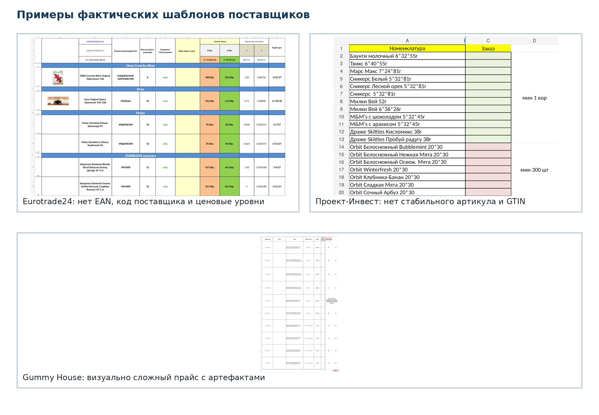
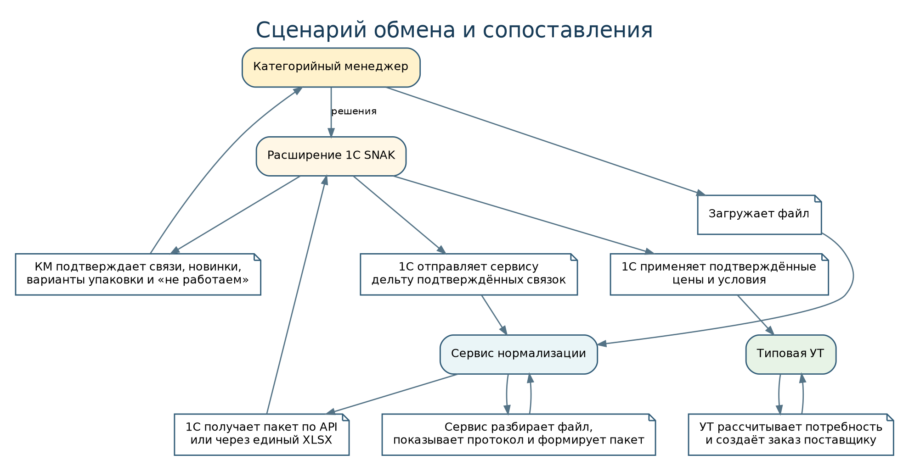

::: {custom-style="DocKicker"}
SNAX · АВТОМАТИЗАЦИЯ ЗАКАЗОВ ПОСТАВЩИКАМ
:::

::: {custom-style="DocTitle"}
ТЕХНИЧЕСКОЕ ЗАДАНИЕ
:::

::: {custom-style="DocSubtitle"}
Гибридная подсистема нормализации прайс-листов поставщиков, сопоставления номенклатуры в 1С:Управление торговлей и централизованного формирования заказов
:::

::: {custom-style="DocVersion"}
Версия 2.0 · Проект для согласования · 17 августа 2026 года
:::

::: {custom-style="Callout"}
**Программа v3.0 (25.08.2026).** Настоящее ТЗ остаётся контрактом контуров нормализации прайсов, сопоставления и заказа. Сквозной устав, календарь, топология «Форус», финансы/розница/продажи и приём выгрузок баз описаны в [PROJECT_CONTRACT.md](PROJECT_CONTRACT.md), [SPEC_PROGRAM.md](SPEC_PROGRAM.md) и [SCHEDULE.md](SCHEDULE.md). Горизонт передачи программы — G7 14.05.2027 при выгрузках не позднее G0; это не отменяет оценки 9–14 недель только для контура файл→заказ.
:::

| Роль | Организация / ФИО | Решение | Дата |
|---|---|---|---|
| Заказчик / владелец процесса |  |  |  |
| Руководитель категорийного менеджмента |  |  |  |
| Владелец системы 1С |  |  |  |
| Исполнитель |  |  |  |

::: {custom-style="Callout"}
**Статус документа.** Настоящая версия заменяет архитектурную часть ТЗ v1.0 и учитывает результаты анализа 26 реальных файлов, 20 профилей поставщиков и решение использовать типовую 1С:УТ как учётное и расчётное ядро. Внешний сервис не рассчитывает потребность и не создаёт заказ поставщику: он безопасно разбирает исходные файлы, нормализует данные и передаёт их в промежуточный контур 1С.
:::

::: {custom-style="Callout"}
**Дополнение 2.1.** Процесс приемки товара, рабочее место магазина, receipt-package, расхождения и создание документов 1С описаны в [TZ_ADDENDUM_RECEIVING.md](TZ_ADDENDUM_RECEIVING.md). Настоящий документ применяется совместно с дополнением.
:::

# Содержание

1. Общие сведения
2. Бизнес-контекст и цели
3. Результаты обследования исходных файлов
4. Целевая модель процесса
5. Функциональные требования к сервису
6. Функциональные требования к 1С
7. Интеграционные требования
8. Бизнес-правила
9. Пользовательские роли и сценарии
10. Нефункциональные требования
11. Данные и хранение
12. Администрирование и контроль
13. Критерии приёмки
14. Этапы реализации
15. Ограничения и исключения из объёма
16. Риски и меры
17. Открытые решения для утверждения
18. Матрица трассируемости
19. Комплект результатов проекта
20. Источники и связанные документы
21. Лист согласования

# 1. Общие сведения

## 1.1. Наименование проекта

**«SNAX — централизованная автоматизация заказов поставщикам»**.

В рамках проекта создаётся гибридное решение из двух взаимосвязанных подсистем:

1. **Сервис нормализации файлов поставщиков** — принимает XLS, XLSX и CSV, определяет профиль шаблона, извлекает и нормализует товарные данные, выполняет контроль качества и формирует версионированный пакет обмена.
2. **Расширение 1С:Управление торговлей** — принимает пакет во временный контур, сопоставляет внешние позиции с номенклатурой SNAX, хранит подтверждённые связи, применяет цены и закупочные параметры, после чего использует типовой механизм обеспечения потребностей и формирования заказов поставщикам.

## 1.2. Основание для разработки

Основанием являются:

- бизнес-задача клиента по переносу функции заказа из магазинов в отдел категорийного менеджмента;
- интервью с владельцами и участниками процесса;
- шаблон текущего расчёта заказа;
- фактические файлы поставщиков;
- формализованное ТЗ v1.0;
- функционально-техническая спецификация v1.0;
- дополнение по анализу шаблонов поставщиков v1.2;
- принятое архитектурное решение: нормализация вне 1С, мастер-данные и расчёт заказа — в 1С.

## 1.3. Термины и сокращения

| Термин | Определение |
|---|---|
| **УТ** | 1С:Управление торговлей. Точный релиз фиксируется после обследования рабочей базы. |
| **КМ** | Категорийный менеджер. |
| **Профиль импорта** | Версионированное декларативное описание структуры файла конкретного поставщика. |
| **Пакет импорта** | Нормализованный набор метаданных, строк, цен, упаковок, наличия и ошибок, передаваемый в 1С. |
| **Внешняя позиция** | Товарная позиция в представлении поставщика. |
| **Каноническая модель** | Единый формат данных, к которому приводятся все шаблоны поставщиков. |
| **Staging / промежуточный контур** | Область 1С, где пакет проверяется и сопоставляется до изменения типовых объектов. |
| **GTIN** | Строковое представление EAN/UPC/GTIN; не считается глобально уникальным ключом. |
| **MOQ** | Минимальное количество заказа. |
| **Кратность** | Допустимый шаг количества заказа. |
| **Master-data** | Авторитетные данные. Для связей с внутренней номенклатурой источником истины является 1С. |
| **Golden file** | Контрольный исходный файл с заранее утверждённым ожидаемым результатом разбора. |
| **Codex** | Инструмент разработки, которому передаются спецификация, задачи и репозиторий; результат его работы проходит тестирование и ревью. |

## 1.4. Границы документа

ТЗ описывает **что должна делать система**, какие данные и статусы должны поддерживаться, где проходят границы ответственности, как принимается результат и какие решения остаются открытыми.

Детали реализации, API, модель данных, структура репозитория, правила работы Codex и последовательность технических задач приведены в отдельной функционально-технической спецификации.

# 2. Бизнес-контекст и цели

## 2.1. Исходная проблема

Заказы поставщикам формируются несколькими магазинами с разным уровнем дисциплины и профессиональной подготовки. При подготовке заказа не всегда учитываются продажи, свободные остатки, резервы, товар в пути, кратность, минимальная партия и условия поставщика. Это создаёт излишние запасы, дефицит, пропущенные новинки и зависимость результата от конкретного сотрудника.

Планируемый масштаб процесса:

- около 20 поставщиков в одном цикле;
- 6–8 магазинов;
- до 2 000 SKU на магазин по отдельным поставщикам;
- два цикла заказа в неделю;
- отдел категорийного менеджмента — 3 сотрудника.

Даже при неполном пересечении ассортимента потенциальный объём строк делает ручную обработку всех заказов неустойчивой.

## 2.2. Бизнес-цели

| ID | Цель | Критерий достижения |
|---|---|---|
| BR-001 | Централизовать заказ товара | Магазины не создают заказ поставщику самостоятельно; функция передана КМ. |
| BR-002 | Сократить трудозатраты КМ | КМ работает прежде всего с исключениями и корректировками, а не с каждой строкой. |
| BR-003 | Снизить влияние человеческого фактора | Рекомендация формируется на одинаковых правилах и данных 1С. |
| BR-004 | Сохранить типовую логику УТ | Расчёт потребности и документ заказа выполняются в 1С, без создания второго расчётного ядра. |
| BR-005 | Автоматизировать разбор файлов | Не менее приоритетных профилей MVP разбираются без ручного копирования колонок. |
| BR-006 | Не терять новинки и исключения | Каждая исходная строка получает прослеживаемый тип и статус. |
| BR-007 | Создать единый справочник связей | Подтверждённые соответствия хранятся и версионируются в 1С. |
| BR-008 | Обеспечить масштабирование | Новый шаблон поставщика подключается конфигурацией профиля, а не переписыванием общего ядра. |

## 2.3. Целевые показатели пилота

- не менее 98% строк контрольного файла должны быть учтены как товар, служебная строка или ошибка;
- отсутствие молчаливой потери строк;
- повторная загрузка того же файла не создаёт дубль;
- ранее подтверждённые связи восстанавливаются автоматически;
- КМ видит все позиции, требующие решения;
- пакет, принятый 1С, воспроизводим по сохранённому исходному файлу, профилю и версии кода;
- стандартный расчёт УТ по контрольным SKU сверяется с согласованной формулой и текущим Excel.

# 3. Результаты обследования исходных файлов

## 3.1. Состав проанализированного корпуса

В анализ включено 26 файлов, из которых 22 уникальны по SHA-256. Выделено 20 профилей поставщиков, в том числе два уникальных legacy-профиля XLS. Построчно разобрано 4 937 товарных позиций XLSX. Обнаружено 238 нормализованных GTIN, встречающихся у двух и более поставщиков, и 409 видимых ошибок формул в пяти последних файлах.

{width=95%}

## 3.2. Выявленные особенности

Файлы существенно различаются:

- заголовок начинается с 1-й по 16-ю строку;
- товарные данные находятся на одном или нескольких листах;
- присутствуют повторные шапки, категории, итоги, комментарии и пустые разделители;
- встречаются объединённые ячейки, скрытые параметры, изображения и вычисляемые листы;
- один файл может содержать несколько ценовых уровней;
- единица заказа может быть штукой, блоком, коробом, ящиком или палетой;
- количество и статус наличия иногда передаются в одной колонке;
- часть файлов не содержит артикула либо надёжного GTIN;
- отдельные GTIN начинаются с точки, теряют ведущий ноль или являются placeholders;
- один GTIN может использоваться для нескольких упаковочных вариантов;
- XLS-файлы продолжают использоваться фактически;
- формулы содержат `#REF!` или зависят от скрытых параметров.

## 3.3. Архитектурный вывод

Создание одного универсального шаблона загрузки в 1С не решает задачу. Требуется версионируемая подсистема профилей и промежуточная модель данных. При этом окончательное сопоставление с номенклатурой и расчёт заказа рационально выполнять в 1С, где находятся авторитетные остатки, продажи, резервы, поступления, упаковки и документы закупки.

# 4. Целевая модель процесса

## 4.1. Архитектура верхнего уровня

{width=92%}

Целевой процесс:

1. Файл поступает в сервис вручную, через выделенный каталог, электронную почту или иной согласованный канал.
2. Сервис сохраняет оригинал, вычисляет SHA-256 и исключает повторную обработку точной копии.
3. Сервис определяет поставщика, профиль и версию шаблона.
4. Все строки читаются в raw-слой с координатами и исходными значениями.
5. Профиль классифицирует строки и поля, сервис нормализует GTIN, числа, даты, цены, упаковки и статусы.
6. Сервис выполняет контроль качества и показывает протокол.
7. Валидированный пакет публикуется для получения 1С либо выгружается в единый XLSX на пилоте.
8. Расширение 1С загружает пакет в staging и пытается применить ранее подтверждённые связи.
9. КМ обрабатывает новинки, неоднозначности, конфликты упаковки и позиции «не работаем».
10. После подтверждения 1С обновляет допустимые типовые данные и расширенные регистры.
11. КМ запускает типовое формирование заказов по потребностям, проверяет предложение и создаёт черновик заказа поставщику.
12. 1С возвращает сервису дельту подтверждённых связей для ускорения будущих загрузок.

## 4.2. Принципы разделения ответственности

| Область | Сервис | 1С |
|---|---:|---:|
| Сохранение оригинального файла | Владелец | Ссылка/идентификатор пакета |
| Чтение XLS/XLSX/CSV | Владелец | Нет |
| Определение профиля и структуры | Владелец | Нет |
| Нормализация полей и строк | Владелец | Контроль контракта |
| Качество исходного файла | Владелец | Отображение итогов |
| Внутренняя номенклатура | Нет | **Владелец** |
| Подтверждённые связи | Кэш-копия | **Владелец** |
| Решение «новинка / не работаем» | Нет | **Владелец** |
| Продажи, остатки, резервы, товар в пути | Нет | **Владелец** |
| Расчёт потребности | Нет | **Владелец** |
| Формирование заказа поставщику | Нет | **Владелец** |
| Аудит преобразований файла | **Владелец** | Идентификаторы и итог |
| Аудит бизнес-решения КМ | Копия при необходимости | **Владелец** |

::: {custom-style="Warning"}
**Запрещённые архитектурные отклонения:** прямое подключение сервиса к таблицам базы 1С; окончательное сопоставление только по похожести названия; создание сервисом документа заказа поставщику; использование остатка поставщика как собственного складского остатка; исполнение макросов и внешних ссылок Excel.
:::

## 4.3. Объём первой версии

### Пилот

- 3–5 контрастных поставщиков;
- ручная загрузка в сервис;
- единый XLSX или JSON-пакет;
- staging и сопоставление в копии 1С;
- сверка типового расчёта по 30–50 контрольным SKU;
- без автоматического проведения документов.

### Промышленный MVP

- 10 приоритетных профилей;
- API-обмен с 1С;
- очередь сопоставления;
- загрузка цен, упаковок и условий после подтверждения;
- стандартный расчёт потребности;
- создание черновика заказа;
- аудит, мониторинг и резервное копирование.

### Полный охват

- 20 профилей, включая legacy XLS;
- плановый запуск по расписанию;
- индивидуальные выходные формы или EDI при необходимости;
- ценовые пороги и расширенные условия;
- статистика качества поставщиков и эффективности рекомендаций.

# 5. Функциональные требования к сервису

## 5.1. Приём и хранение файлов

| ID | Требование | Приоритет |
|---|---|---|
| FR-SVC-001 | Сервис принимает XLSX, XLS и CSV в пределах разрешённого размера. | Must |
| FR-SVC-002 | Для каждого файла вычисляется SHA-256; точная копия получает статус `DUPLICATE_FILE` и не создаёт повторные строки. | Must |
| FR-SVC-003 | Оригинал сохраняется неизменяемо вместе с именем, размером, MIME-типом, поставщиком и временем получения. | Must |
| FR-SVC-004 | Сервис не исполняет VBA, макросы, внешние ссылки и встроенный код. | Must |
| FR-SVC-005 | XLS разбирается отдельным изолированным reader/worker либо контролируемой конвертацией. | Must |
| FR-SVC-006 | Доступ к исходным файлам предоставляется только ролям с соответствующим разрешением. | Must |

## 5.2. Профили и чтение структуры

| ID | Требование | Приоритет |
|---|---|---|
| FR-SVC-007 | Структура поставщика описывается версионируемым декларативным профилем. | Must |
| FR-SVC-008 | Профиль задаёт признаки файла, листы, диапазоны, строки заголовков, типы строк, сопоставление колонок и правила нормализации. | Must |
| FR-SVC-009 | Сервис предлагает профиль автоматически и допускает ручное подтверждение/замену до публикации. | Must |
| FR-SVC-010 | Изменение структуры, не соответствующее активной версии профиля, блокирует публикацию и создаёт `TEMPLATE_CHANGED`. | Must |
| FR-SVC-011 | Все исходные ячейки читаются в raw-слой с именем листа, номером строки и колонки, формулой и кэшированным значением, если доступно. | Must |
| FR-SVC-012 | Поддерживается обработка нескольких листов и нескольких товарных диапазонов в одном файле. | Must |
| FR-SVC-013 | Повторные шапки, категории, итоги, комментарии и пустые строки распознаются отдельно и не превращаются в товары. | Must |
| FR-SVC-014 | Производные листы с ошибочными формулами могут быть исключены профилем при сохранении факта исключения. | Must |

## 5.3. Нормализация

| ID | Требование | Приоритет |
|---|---|---|
| FR-SVC-015 | GTIN хранится строкой; экспоненциальная запись и числовое округление запрещены. | Must |
| FR-SVC-016 | Любое исправление GTIN, включая удаление точки и добавление ведущего нуля, фиксируется как transformation event. | Must |
| FR-SVC-017 | Восстановление ведущего нуля допускается только при валидной контрольной цифре и разрешении профиля. | Must |
| FR-SVC-018 | Placeholders, заведомо не являющиеся штрихкодами, не используются для автоматического сопоставления. | Must |
| FR-SVC-019 | Числа, даты и валюты нормализуются с учётом локали; исходное значение сохраняется. | Must |
| FR-SVC-020 | Единица заказа, количество единиц в упаковке и коэффициенты пересчёта передаются раздельно. | Must |
| FR-SVC-021 | Все ценовые уровни передаются без преждевременного выбора одной цены. | Must |
| FR-SVC-022 | Числовое количество, статус наличия и комментарий поставщика разделяются на независимые поля. | Must |
| FR-SVC-023 | MOQ, кратность, минимальная сумма и ожидаемая дата поставки передаются отдельными атрибутами. | Must |
| FR-SVC-024 | Формулы поставщика не являются источником истины для итогов; суммы и пересчёты вычисляются кодом. | Must |

## 5.4. Контроль качества и публикация

| ID | Требование | Приоритет |
|---|---|---|
| FR-SVC-025 | Каждая исходная строка получает тип: `PRODUCT`, `CATEGORY`, `HEADER`, `TOTAL`, `COMMENT`, `BLANK`, `DERIVED` или `ERROR`. | Must |
| FR-SVC-026 | Каждая товарная строка получает стабильный идентификатор и ссылку на исходный лист/строку. | Must |
| FR-SVC-027 | Дубликаты строк внутри файла выявляются по правилам профиля и не удваивают итог без явного решения. | Must |
| FR-SVC-028 | Критические ошибки блокируют публикацию; некритические передаются в 1С вместе со строкой. | Must |
| FR-SVC-029 | До публикации пользователь видит сводку: строк всего, товарных, исключённых, ошибок, предупреждений и преобразований. | Must |
| FR-SVC-030 | Публикация формирует пакет по версионированной JSON Schema; для пилота доступен эквивалентный XLSX. | Must |
| FR-SVC-031 | Обработка выполняется асинхронно, повторяемо и идемпотентно. | Must |
| FR-SVC-032 | Для каждой загрузки можно выгрузить протокол ошибок и преобразований в XLSX. | Should |

# 6. Функциональные требования к 1С

## 6.1. Промежуточный контур

| ID | Требование | Приоритет |
|---|---|---|
| FR-1C-001 | Расширение создаёт объект «Импорт прайс-листа SNAX» или эквивалентный staging-документ. | Must |
| FR-1C-002 | Повторная загрузка одного `packageId` и версии не создаёт дубль. | Must |
| FR-1C-003 | Хранятся поставщик, профиль, версия, SHA-256, имя файла, даты, счётчики и состояние пакета. | Must |
| FR-1C-004 | Строки staging не меняют цены, номенклатуру и документы до команды применения. | Must |
| FR-1C-005 | Для каждой строки сохраняется ссылка на внешнюю позицию, исходную координату, цену, упаковку, наличие, ошибки и статус сопоставления. | Must |

## 6.2. Сопоставление номенклатуры

| ID | Требование | Приоритет |
|---|---|---|
| FR-1C-006 | Сначала применяется активная ранее подтверждённая связь по поставщику и внешнему варианту. | Must |
| FR-1C-007 | При отсутствии связи система ищет точное совместимое совпадение по GTIN и упаковке. | Must |
| FR-1C-008 | Артикул поставщика ищется только в контексте этого поставщика. | Must |
| FR-1C-009 | Похожесть наименований используется только для ранжирования кандидатов, но не для финальной автоматической связи. | Must |
| FR-1C-010 | Пользователь может выбрать номенклатуру, характеристику и упаковку 1С либо создать заявку на новую карточку. | Must |
| FR-1C-011 | Поддерживаются статусы `MATCHED_SAVED`, `MATCHED_EXACT`, `REVIEW_REQUIRED`, `MULTIPLE_MATCHES`, `NEW_ITEM`, `PACKAGING_CONFLICT`, `NOT_IN_ASSORTMENT`, `DO_NOT_BUY`, `MISSING_KEY`, `DATA_ERROR`, `APPROVED`. | Must |
| FR-1C-012 | Решение `DO_NOT_BUY` сохраняется и не возвращает строку в очередь при каждой загрузке без изменения ключевых атрибутов. | Must |
| FR-1C-013 | Изменение GTIN, упаковки, артикула или значимых характеристик ранее связанной позиции создаёт конфликт и требует проверки. | Must |
| FR-1C-014 | Каждое ручное решение хранит пользователя, дату, источник, предыдущие значения и комментарий. | Must |

## 6.3. Применение данных и заказ

| ID | Требование | Приоритет |
|---|---|---|
| FR-1C-015 | Только подтверждённые строки могут применяться к типовым объектам и регистрам расширения. | Must |
| FR-1C-016 | Где возможно, связь отражается в типовой «Номенклатуре партнёра»; расширенная история хранится в регистре расширения. | Must |
| FR-1C-017 | Подтверждённые цены поставщика регистрируются с датой действия и источником. | Must |
| FR-1C-018 | Ценовые лестницы и пороги хранятся отдельно, если типовой модели недостаточно. | Must |
| FR-1C-019 | Упаковки, MOQ, кратность и минимальная сумма применяются только после проверки единиц измерения. | Must |
| FR-1C-020 | Остаток/наличие поставщика хранится отдельно и не увеличивает складской остаток SNAX. | Must |
| FR-1C-021 | Потребность рассчитывается типовым механизмом УТ на данных продаж, остатков, резервов, поступлений и настроек обеспечения. | Must |
| FR-1C-022 | КМ может изменить предложенное количество; для существенного отклонения фиксируется причина. | Should |
| FR-1C-023 | Итоговый документ «Заказ поставщику» создаётся в 1С как черновик и проводится только в соответствии с ролями и процессом согласования. | Must |
| FR-1C-024 | 1С формирует дельту подтверждённых связей для возврата сервису. | Must |
| FR-1C-025 | Доступны отчёты по загрузкам, несопоставленным позициям, изменениям поставщика, ценам и действиям КМ. | Should |

# 7. Интеграционные требования

## 7.1. Основной способ обмена

Для промышленного контура используется JSON по HTTPS через версионированный API. Рекомендуемая схема — **1С по расписанию запрашивает готовые пакеты у сервиса**, поскольку это позволяет не публиковать входящий endpoint 1С во внешнюю сеть. Допускается иной вариант при наличии защищённой корпоративной интеграционной шины.

Для пилота допускается единый XLSX с фиксированной структурой и ручным запуском внешней обработки 1С.

## 7.2. Требования к контракту

| ID | Требование | Приоритет |
|---|---|---|
| FR-INT-001 | Обмен выполняется по HTTPS и JSON UTF-8; формат описан OpenAPI и JSON Schema. | Must |
| FR-INT-002 | Для пилота контракт имеет эквивалентное XLSX-представление. | Must |
| FR-INT-003 | Каждый пакет имеет глобальный `packageId`, `schemaVersion`, `profileVersion` и `idempotencyKey`. | Must |
| FR-INT-004 | Пакет может передаваться частями; порядок и полнота проверяются по manifest. | Must |
| FR-INT-005 | 1С подтверждает получение и итог обработки отдельным ACK. | Must |
| FR-INT-006 | Повторы после timeout безопасны и не создают дубликаты. | Must |
| FR-INT-007 | Каждый запрос содержит `correlationId`, используемый в логах обеих систем. | Must |
| FR-INT-008 | Ошибки возвращаются в единой структуре с кодом, сообщением, полем и возможностью повторения. | Must |
| FR-INT-009 | Даты передаются в ISO 8601; системное время хранится в UTC. | Must |
| FR-INT-010 | Денежные и количественные значения передаются строкой decimal, а не binary float. | Must |
| FR-INT-011 | GTIN и любые внешние коды передаются строкой. | Must |
| FR-INT-012 | При конфликте кэша связок и 1С авторитетным считается состояние 1С. | Must |
| FR-INT-013 | API поддерживает retry с backoff, ограничение запросов и circuit breaker на стороне клиента. | Must |
| FR-INT-014 | Оригинальный файл не обязан передаваться в 1С; в пакет входит идентификатор и контролируемая ссылка либо архивный ключ. | Should |
| FR-INT-015 | Прямой доступ к базе данных 1С и её таблицам запрещён. | Must |

## 7.3. Последовательность обмена

{width=94%}

## 7.4. Состояния пакета

Сервис поддерживает состояния:

`RECEIVED → PROCESSING → VALIDATED → READY_FOR_1C → DELIVERED → ACCEPTED_BY_1C → ARCHIVED`.

Альтернативные ветви: `DUPLICATE`, `PROFILE_REVIEW`, `BLOCKED`, `REJECTED_BY_1C`, `ERROR`.

В 1С staging-пакет поддерживает состояния:

`NEW → LOADED → MATCHING → READY_TO_APPLY → APPLIED`.

Альтернативные состояния: `PARTIAL`, `REJECTED`, `CANCELLED`, `ERROR`.

# 8. Бизнес-правила

## 8.1. Идентификация внешней позиции

Ни один единичный атрибут не признаётся универсальным ключом. Внешний вариант формируется из согласованной комбинации:

`поставщик + код поставщика (при наличии) + нормализованный GTIN (при наличии) + вариант упаковки`.

Вариант упаковки включает как минимум единицу заказа и количество базовых единиц. При отсутствии устойчивого кода сервис создаёт технический отпечаток позиции, но такая строка не может быть автоматически связана впервые.

## 8.2. Правила GTIN

1. GTIN хранится только строкой.
2. Пробелы, разделители и одна ведущая точка могут быть удалены по явному правилу профиля.
3. Ведущий ноль восстанавливается только при прохождении контрольной цифры и сохранении исходного значения.
4. Невалидный код остаётся в исходном поле и получает предупреждение или ошибку.
5. Один GTIN может принадлежать нескольким поставщикам и нескольким упаковочным вариантам.
6. Точное совпадение GTIN без совместимой упаковки не даёт автоматической связи.

## 8.3. Правила цен

1. Все ценовые уровни сохраняются.
2. Валюта, единица цены, НДС, порог и период действия передаются отдельно.
3. Цена не выбирается сервисом, если выбор зависит от суммы заказа или условий договора.
4. При ценовой лестнице итоговая цена проверяется после расчёта всего заказа.
5. Сломанные формулы и итоговые колонки поставщика не считаются доверенными.
6. Применённая в 1С цена сохраняет ссылку на пакет и исходную строку.

## 8.4. Правила упаковок

1. Базовая единица, единица заказа и коэффициент пересчёта разделяются.
2. Количество «2 короба» не преобразуется в штуки без известного коэффициента.
3. Одна позиция поставщика может иметь несколько вариантов поставки.
4. Конфликт между упаковкой поставщика и упаковкой 1С блокирует автоматическое применение.
5. Округление до кратности и MOQ выполняется типовым механизмом или согласованной доработкой 1С, но не парсером.

## 8.5. Правила наличия поставщика

- «В наличии», «в транзите», «ожидается», «нет в наличии» и другие фразы нормализуются в справочник статусов с сохранением исходного текста.
- Остаток поставщика используется как ограничение или информационный показатель по согласованному правилу.
- Остаток поставщика никогда не записывается как собственный остаток склада.
- Ожидаемое поступление поставщика учитывается только при определённом статусе и дате.

## 8.6. Правила сопоставления

Порядок поиска кандидатов:

1. активная подтверждённая связь по внешнему варианту;
2. поставщик + артикул поставщика + совместимая упаковка;
3. уникальный точный GTIN + совместимая упаковка;
4. уникальный артикул в пределах поставщика;
5. ранжирование кандидатов по бренду, наименованию, весу, вкусу, объёму и категории;
6. статус `NEW_ITEM` при отсутствии приемлемого кандидата.

Только ранее подтверждённая связь может применяться полностью автоматически. Новый кандидат, найденный по точным полям, может быть помечен `MATCHED_EXACT`, но его политика автоподтверждения отдельно утверждается на пилоте.

## 8.7. Статусы сопоставления

| Статус | Назначение | Действие пользователя |
|---|---|---|
| `MATCHED_SAVED` | Применена действующая связь | Обычно не требуется |
| `MATCHED_EXACT` | Найден один точный совместимый кандидат | Подтвердить либо автоподтвердить по политике |
| `REVIEW_REQUIRED` | Есть вероятный кандидат | Выбрать/отклонить |
| `MULTIPLE_MATCHES` | Несколько кандидатов | Выбрать один |
| `NEW_ITEM` | Аналог не найден | Заявка на создание или «не работаем» |
| `PACKAGING_CONFLICT` | Товар найден, упаковка несовместима | Настроить упаковку |
| `NOT_IN_ASSORTMENT` | Связь есть, но товар не входит в матрицу | Включить/исключить |
| `DO_NOT_BUY` | Принято решение не работать | При необходимости пересмотреть |
| `MISSING_KEY` | Нет надёжного ключа | Ручная проверка |
| `DATA_ERROR` | Ошибка исходных данных | Исправление профиля/файла |
| `APPROVED` | Решение подтверждено | Доступно применение |

## 8.8. Расчёт заказа

Сервис не рассчитывает рекомендованное количество. После применения подтверждённых данных 1С использует типовой механизм обеспечения потребностей. Конкретная настройка должна учитывать:

- период статистики продаж;
- исключение или учёт дней отсутствия;
- метод Min–Max, норму или статистику;
- свободный остаток;
- резервы;
- подтверждённый товар в пути;
- дату отсечения поступлений;
- срок поставки;
- период покрытия;
- страховой запас;
- кратность и MOQ;
- минимальную сумму заказа;
- ассортиментную матрицу магазина;
- лимиты и бюджеты при их наличии.

Контрольная формула и состав документов утверждаются по результатам пилота в копии базы.

# 9. Пользовательские роли и сценарии

## 9.1. Роли

| Роль | Основные права |
|---|---|
| Администратор сервиса | Пользователи, поставщики, профили, повторный запуск, просмотр аудита |
| Оператор импорта | Загрузка файла, выбор профиля, просмотр протокола, публикация валидного пакета |
| Разработчик профилей | Создание и тестирование версий профиля без доступа к бизнес-решениям 1С |
| Администратор 1С | Настройка обмена, ролей, регламентных заданий и технических справочников |
| Категорийный менеджер | Сопоставление, решение по новинкам, применение данных, корректировка рекомендации |
| Руководитель КМ | Контроль исключений, согласование правил и заказов, отчётность |
| Аудитор / наблюдатель | Только чтение протоколов, связей и действий |

## 9.2. Основной пользовательский сценарий

1. Оператор загружает файл и выбирает поставщика при необходимости.
2. Сервис показывает найденный профиль, счётчики и ошибки.
3. При критической ошибке оператор отправляет файл на исправление или разработчик создаёт новую версию профиля.
4. Валидный пакет публикуется.
5. 1С получает его регламентным заданием и создаёт staging-документ.
6. Ранее известные позиции связываются автоматически.
7. КМ открывает рабочее место и последовательно обрабатывает вкладки исключений.
8. После устранения блокирующих статусов КМ применяет подтверждённые данные.
9. 1С регистрирует цены и условия, не изменяя собственные остатки данными поставщика.
10. КМ запускает формирование заказов по потребностям и проверяет рекомендацию.
11. Существенные ручные изменения сопровождаются причиной.
12. Создаётся черновик заказа поставщику.
13. Подтверждённые связи возвращаются в сервис.

## 9.3. Интерфейс рабочего места 1С

Рабочее место должно иметь:

- фильтры по пакету, поставщику, статусу, категории и ответственному;
- вкладки статусов сопоставления;
- исходное и нормализованное наименование;
- исходный лист и номер строки;
- код, GTIN, бренд, вес, упаковку и цены поставщика;
- кандидатов 1С с объяснением совпадения;
- команды массового подтверждения безопасных строк;
- одиночное и групповое решение `DO_NOT_BUY`;
- команду «создать заявку на новую номенклатуру»;
- историю предыдущих решений;
- индикатор блокирующих ошибок;
- итоговые счётчики до применения.

# 10. Нефункциональные требования

| ID | Требование | Критерий |
|---|---|---|
| NFR-001 | Прослеживаемость | Для каждой нормализованной строки доступен исходный файл, лист, строка, профиль и журнал преобразований. |
| NFR-002 | Отсутствие молчаливых потерь | Сумма классифицированных строк равна числу считанных строк с учётом технических ограничений. |
| NFR-003 | Идемпотентность | Повтор файла, пакета и ACK не создаёт дубли. |
| NFR-004 | Производительность импорта | Целевое время p95 для 5 000 строк — не более 180 секунд без учёта ручной проверки. |
| NFR-005 | Масштабируемость | Архитектура допускает не менее 100 000 строк в сутки и горизонтальное увеличение worker-процессов. |
| NFR-006 | Интерфейс | p95 основных списков и карточек при штатной нагрузке — не более 2 секунд. |
| NFR-007 | Доступность | После стабилизации промышленного MVP — 99,5% в согласованное рабочее время. |
| NFR-008 | Безопасность файлов | Макросы и внешние ссылки не исполняются; действуют лимиты размера, типа и времени обработки. |
| NFR-009 | Защита обмена | TLS, сервисные учётные записи, минимальные права, ротация секретов. |
| NFR-010 | Аудит | Неизменяемый журнал публикаций, преобразований, подтверждений и повторных запусков. |
| NFR-011 | Наблюдаемость | Структурированные логи, метрики, health/readiness, correlation ID и алерты. |
| NFR-012 | Резервное копирование | БД, профили и объектное хранилище резервируются; восстановление проверяется. |
| NFR-013 | Среды | Разделены dev, test и prod; производственные файлы не используются в открытом тестовом репозитории. |
| NFR-014 | Обновляемость | Профили меняются без развёртывания общего ядра, если не требуется новая функция parser runtime. |
| NFR-015 | Качество кода | Типизация, статический анализ, unit/integration/golden tests и обязательное ревью. |
| NFR-016 | Локализация | Интерфейс на русском; технические коды ошибок и поля контракта стабильны и англоязычны. |

# 11. Данные и хранение

## 11.1. Канонические группы полей

| Группа | Поля |
|---|---|
| Пакет | `packageId`, поставщик, профиль, версия, SHA-256, имя, дата прайса, валюта, срок действия |
| Трассировка | лист, номер строки, диапазон, raw-идентификатор, версия преобразования |
| Идентификация товара | код поставщика, исходное и нормализованное наименование, бренд, GTIN, дополнительные коды |
| Характеристики | вес, объём, вкус, категория, текстовое описание |
| Упаковка | базовая единица, единица заказа, количество базовых единиц, вес/объём упаковки |
| Цены | тип цены, значение, валюта, НДС, единица цены, порог, дата действия |
| Наличие | количество поставщика, статус, ожидаемая дата, комментарий |
| Ограничения | MOQ, кратность, минимальная сумма, максимальная доступность |
| Качество | тип строки, статус, ошибки, предупреждения, transformations |
| Сопоставление | внешний вариант, GUID номенклатуры/характеристики/упаковки 1С, статус и версия связи |

## 11.2. Сроки хранения

Окончательные сроки утверждаются заказчиком. По умолчанию рекомендуется:

- исходные файлы и пакеты — не менее 3 лет;
- аудит бизнес-решений — не менее 5 лет либо по политике 1С;
- технические логи — 90–180 дней;
- метрики — 13 месяцев для сезонного сравнения;
- удаление — только по регламенту с записью аудита.

# 12. Администрирование и контроль

| ID | Требование |
|---|---|
| FR-ADM-001 | Управление пользователями и ролями интегрировано с корпоративным способом аутентификации либо реализовано локально на пилоте. |
| FR-ADM-002 | Все изменения профиля имеют автора, версию, комментарий и дату активации. |
| FR-ADM-003 | Повторный запуск создаёт новый processing run, не изменяя предыдущий результат. |
| FR-ADM-004 | Ошибки имеют стабильные коды и классификацию severity/retryable. |
| FR-ADM-005 | Администратор выгружает протокол загрузки и сверки. |
| FR-ADM-006 | Доступны health, readiness и метрики очередей, ошибок и времени обработки. |
| FR-ADM-007 | Настраиваются сроки хранения и архивирования. |
| FR-ADM-008 | Секреты не хранятся в исходном коде и файлах профилей. |
| FR-ADM-009 | Dev/test/prod используют раздельные БД, хранилища и credentials. |
| FR-ADM-010 | Резервное восстановление документируется и периодически проверяется. |

# 13. Критерии приёмки

| ID | Сценарий | Ожидаемый результат |
|---|---|---|
| AC-001 | Повторная загрузка точной копии | Статус `DUPLICATE_FILE`, новые строки и пакет не создаются. |
| AC-002 | Файл с повторными шапками | Шапки классифицированы, товарные строки не потеряны и не задвоены. |
| AC-003 | Файл с несколькими листами | Обработаны только разрешённые диапазоны, источник каждой строки сохранён. |
| AC-004 | ОПТ1/ОПТ2 | 540 товарных строк; 32 кода с точкой нормализованы с аудитом; 1 строка без GTIN получает соответствующий статус. |
| AC-005 | Суфлет/SOJ | 64 товара берутся с листа «Прайс SOJ»; производный лист с 369 `#REF!` не используется как источник товаров. |
| AC-006 | Сабитов | Сохраняются четыре варианта единицы заказа и коэффициенты пересчёта. |
| AC-007 | ИП Вагабова | Placeholders не используются как GTIN; восстановление ведущего нуля выполняется только после проверки контрольной цифры. |
| AC-008 | Несколько ценовых уровней | Все уровни переданы в пакет, ни один не потерян. |
| AC-009 | Один GTIN, разные упаковки | Созданы разные внешние варианты; автоматического ошибочного объединения нет. |
| AC-010 | Ранее подтверждённая связь | При следующем пакете 1С восстанавливает её без повторной ручной работы. |
| AC-011 | Неоднозначный кандидат | Строка попадает в `MULTIPLE_MATCHES`, типовые данные не меняются. |
| AC-012 | Решение «не работаем» | Оно сохраняется и не возвращается как новинка без значимого изменения. |
| AC-013 | Повтор API-пакета | Повтор безопасен, в 1С один staging-документ. |
| AC-014 | Ошибка при применении части строк | Пакет получает `PARTIAL`, успешные и ошибочные строки видны отдельно; повтор контролируем. |
| AC-015 | Контрольный расчёт УТ | Результат по 30–50 SKU объясним и сверяется с утверждённым расчётом. |
| AC-016 | Создание заказа | Создаётся черновик заказа в 1С с прослеживаемостью до потребности и пакета поставщика. |

## 13.1. Условия завершения пилота

Пилот считается успешным при одновременном выполнении условий:

- не менее трёх выбранных профилей проходят golden tests;
- нет критической потери строк;
- КМ завершает сопоставление в рабочем месте 1С;
- подтверждённые связи повторно применяются;
- цены/упаковки не искажаются;
- контрольный расчёт потребности согласован;
- заказ создаётся только после пользовательского подтверждения;
- сформирован перечень доработок промышленного MVP с оценкой.

# 14. Этапы реализации

| Этап | Состав | Оценка |
|---|---|---:|
| 0. Обследование | Релиз и доработки УТ, объекты данных, роли, контрольные SKU, бизнес-решения | 3–5 рабочих дней |
| 1. Контракты и каркас | Репозиторий, схемы, API, CI, БД, object storage, аудит | 5–7 дней |
| 2. Платформа парсеров | Raw-слой, XLSX/CSV/XLS, профиль DSL, нормализация, DQ, golden tests | 10–15 дней |
| 3. Расширение 1С | Staging, регистры связей, статусы, рабочее место КМ | 10–15 дней |
| 4. Интеграция | Polling API, ACK, дельта связей, идемпотентность и мониторинг | 5–8 дней |
| 5. Пилот УТ | Применение данных, настройка обеспечения, сверка расчёта, черновик заказа | 7–12 дней |
| 6. Промышленный MVP | 10 профилей, безопасность, эксплуатация, обучение | дополнительно 2–4 недели |
| 7. Полный корпус | Все 20 профилей, legacy XLS, индивидуальные особенности | общий горизонт 9–14 недель |

Оценки экспертные и уточняются после этапа 0. Работы по сервису и расширению 1С могут выполняться параллельно.

# 15. Ограничения и исключения из объёма

В базовый MVP не входят, если не утверждены отдельно:

- прогнозирование с машинным обучением;
- автоматическое создание номенклатуры без согласования;
- проведение заказа без КМ;
- изменение типовой конфигурации вместо расширения;
- прямой доступ к БД 1С;
- автоматическая работа с личными кабинетами всех поставщиков;
- EDI для поставщиков, не подключённых к согласованному провайдеру;
- автоматический выбор сложного ценового порога без утверждённого правила;
- расчёт распределения между магазинами вне возможностей типовой УТ;
- мобильное приложение;
- перенос исторических неструктурированных связей без отдельного плана миграции.

# 16. Риски и меры

| Риск | Вероятность / влияние | Мера |
|---|---|---|
| Неизвестный релиз и доработки УТ | Высокое | Начать с технического обследования и копии базы. |
| Некачественные упаковки и единицы 1С | Высокое | Отдельная подготовка master-data и блокирующая проверка. |
| Частое изменение файлов поставщика | Высокое | Сигнатура структуры, версии профиля, алерт `TEMPLATE_CHANGED`. |
| Неверный автосвязанный товар | Критическое | Авто применять только подтверждённые связи; GTIN + упаковка; аудит. |
| Дубли пакетов | Среднее | SHA-256, packageId, idempotency key, уникальные индексы. |
| Сломанные формулы и макросы | Высокое | Не исполнять, пересчитывать кодом, изолировать legacy-reader. |
| Низкая производительность 1С | Среднее | Пакетная загрузка, регламентные задания, нагрузочный тест на копии. |
| Двойной источник связей | Высокое | 1С — источник истины; сервис хранит только синхронизируемый кэш. |
| Расхождение типового расчёта и Excel | Высокое | Контрольные SKU, документирование параметров, решение на пилоте. |
| Разрастание MVP | Среднее | Волны поставщиков, backlog, формальные критерии изменения объёма. |

# 17. Открытые решения для утверждения

| ID | Решение | Владелец |
|---|---|---|
| D-01 | Точный релиз УТ, режим поддержки и перечень существующих расширений | Владелец 1С |
| D-02 | 3–5 поставщиков пилота и 10 поставщиков промышленного MVP | Руководитель КМ |
| D-03 | Канал обмена: polling 1С, push или интеграционная шина | ИТ |
| D-04 | Правила выбора цены при нескольких порогах | Бизнес |
| D-05 | Использование качественного и количественного наличия поставщика | Бизнес |
| D-06 | Политика восстановления ведущего нуля GTIN | КМ + master-data |
| D-07 | Представление одного GTIN с несколькими упаковками в 1С | Владелец 1С |
| D-08 | Единица заказа и коэффициенты по каждому поставщику | КМ |
| D-09 | Разрешена ли частичная публикация/применение пакета | Бизнес + ИТ |
| D-10 | Какие типовые объекты УТ обновляются автоматически | Владелец 1С |
| D-11 | Процесс создания и согласования новой номенклатуры | Бизнес |
| D-12 | Аутентификация сервиса и размещение инфраструктуры | ИТ / ИБ |
| D-13 | Сроки хранения файлов, пакетов и аудита | ИБ / юристы |
| D-14 | Порог «существенной» ручной корректировки заказа и обязательные причины | Руководитель КМ |

# 18. Матрица трассируемости

| Бизнес-цель | Основные требования | Приёмка |
|---|---|---|
| BR-001 Централизация | FR-1C-021…023, роли КМ | AC-015, AC-016 |
| BR-002 Снижение трудозатрат | FR-1C-006…013, FR-SVC-027…032 | AC-010…012 |
| BR-003 Единые правила | FR-1C-019…023, раздел 8.8 | AC-015 |
| BR-004 Типовая УТ | Граница ответственности, FR-1C-021…023 | AC-016 |
| BR-005 Автоматизация файлов | FR-SVC-001…032 | AC-002…009 |
| BR-006 Новинки и исключения | FR-SVC-025…029, FR-1C-011…014 | AC-011, AC-012 |
| BR-007 Единые связи | FR-1C-006…018, FR-INT-012 | AC-010 |
| BR-008 Масштабирование | FR-SVC-007…014, NFR-005, NFR-014 | Golden tests новых профилей |

# 19. Комплект результатов проекта

Исполнитель передаёт:

1. исходный код сервиса;
2. расширение 1С и исходные тексты модулей;
3. миграции БД;
4. OpenAPI и JSON Schema;
5. профиль DSL и профили поставщиков утверждённой волны;
6. golden files и автоматические тесты;
7. инструкции развёртывания, резервного копирования и восстановления;
8. инструкции оператора импорта, КМ и администратора;
9. журнал известных ограничений;
10. протокол пилота и результаты сверки расчёта;
11. эксплуатационные метрики и алерты;
12. акт приёмки по согласованным сценариям.

# 20. Источники и связанные документы

- Формализованное ТЗ автоматизации заказов v1.0.
- Функционально-техническая спецификация заказов v1.0.
- Дополнение к ТЗ и ФТС: анализ шаблонов поставщиков v1.2.
- Реестр анализа шаблонов поставщиков v1.2.
- Официальная документация платформы 1С по JSON, HTTP-сервисам и REST/OData.
- Официальные материалы 1С:УТ по обеспечению потребностей, номенклатуре партнёров, упаковкам и условиям закупки.
- Официальная документация OpenAI Codex и правила репозитория настоящего проекта.

# 21. Лист согласования

| Пункт | Решение / комментарий |
|---|---|
| Архитектура «сервис нормализации + 1С» |  |
| Границы пилота |  |
| Состав MVP |  |
| Ответственный за master-data |  |
| Правила цены и упаковки |  |
| Типовой метод расчёта УТ |  |
| Инфраструктура и безопасность |  |
| Сроки хранения |  |
| Дополнительные требования |  |

**Итоговое решение:** ☐ утверждено ☐ утверждено с замечаниями ☐ направлено на доработку
