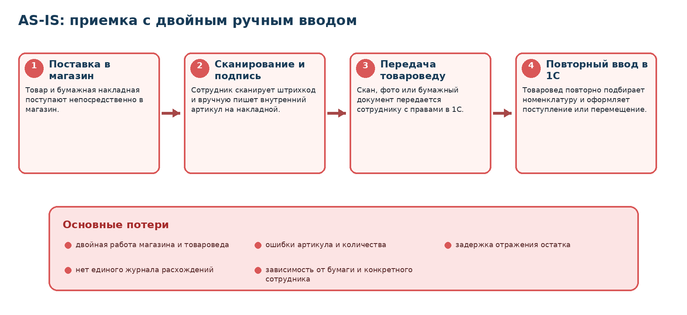
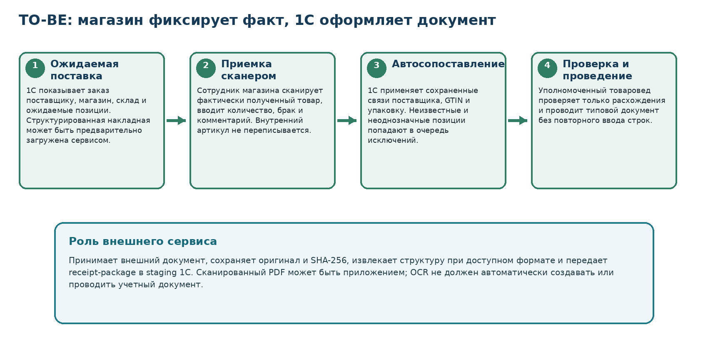
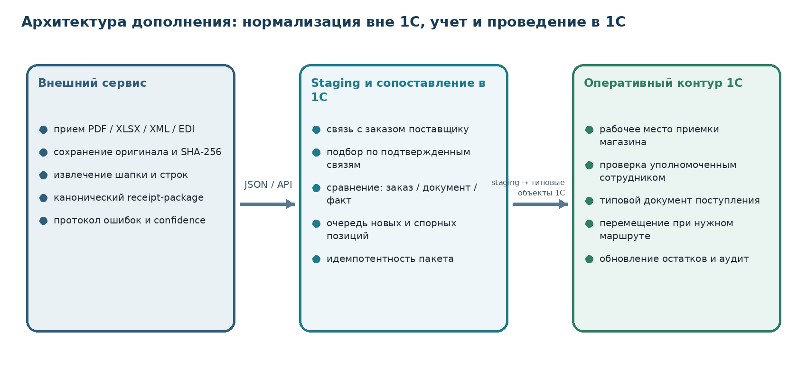

::: {custom-style="DocKicker"}
SNAX · АВТОМАТИЗАЦИЯ ЗАКАЗОВ И ПРИЕМКИ ТОВАРА
:::

::: {custom-style="DocTitle"}
ДОПОЛНЕНИЕ № 1 К ТЕХНИЧЕСКОМУ ЗАДАНИЮ
:::

::: {custom-style="DocSubtitle"}
Автоматизация приемки поставок в магазинах, сопоставления фактически полученного товара и формирования документов в 1С:Управление торговлей без повторного ручного ввода
:::

::: {custom-style="DocVersion"}
Версия 2.1 · Проект для согласования · 18 августа 2026 года
:::

| Роль | Организация / ФИО | Решение | Дата |
|---|---|---|---|
| Заказчик / владелец процесса |  |  |  |
| Руководитель категорийного менеджмента |  |  |  |
| Руководитель розницы |  |  |  |
| Владелец системы 1С |  |  |  |
| Исполнитель |  |  |  |

::: {custom-style="Callout"}
**Статус документа.** Репозиторная копия обезличена и не содержит исходный УПД, цены, банковские реквизиты и переписку. Настоящее дополнение является неотъемлемой частью ТЗ «SNAX - гибридный импорт и 1С» версии 2.0 и функционально-технической спецификации версии 2.0. Оно расширяет проект процессом приемки товара. Базовый архитектурный принцип сохраняется: внешний сервис нормализует внешние документы, а 1С является источником истины для номенклатуры, подтвержденных связей, складских остатков и учетных документов.
:::

```{=openxml}
<w:p><w:r><w:br w:type="page"/></w:r></w:p>
```

# Содержание

1. Основание и назначение дополнения
2. Описание процесса AS-IS
3. Анализ предоставленного примера
4. Цели и показатели результата
5. Границы автоматизации
6. Целевой процесс TO-BE
7. Архитектура и распределение ответственности
8. Функциональные требования к внешнему сервису
9. Функциональные требования к 1С
10. Правила сопоставления и обработки расхождений
11. Роли и права пользователей
12. Данные и интеграционные контракты
13. Статусы и переходы
14. Нефункциональные требования
15. Критерии приемки и UAT-сценарии
16. Этапы реализации
17. Ограничения и открытые решения
18. Изменения к backlog проекта для Codex
19. Матрица трассируемости
20. Лист согласования

# 1. Основание и назначение дополнения

## 1.1. Основание

Дополнение подготовлено на основании:

- сообщения владельца процесса о значительных трудозатратах магазина и товароведов при приемке товара;
- контрольного примера универсального передаточного документа на 32 строки;
- базового ТЗ версии 2.0;
- функционально-технической спецификации для Codex версии 2.0;
- принятого решения использовать подтвержденные связи «позиция поставщика - номенклатура SNAX» не только при заказе, но и при приемке поставки.

## 1.2. Назначение

Документ формализует дополнительный бизнес-процесс: физическое получение товара магазином, фиксацию фактически принятого количества, выявление расхождений и создание учетного документа в 1С без ручного переписывания внутренних артикулов и повторного ввода строк товароведом.

## 1.3. Термины

| Термин | Определение |
|---|---|
| **Приемочная сессия** | Набор действий сотрудника магазина по конкретной поставке: открытие ожидаемой поставки, сканирование товаров, фиксация количества и расхождений, завершение приемки. |
| **Ожидаемая поставка** | Заказ поставщику либо иной документ-основание 1С, содержащий поставщика, магазин/склад и ожидаемые позиции. |
| **Документ поставщика** | УПД, накладная, счет-фактура, Excel-бланк, XML/EDI-сообщение или иной внешний документ поставки. |
| **Receipt-package** | Канонический пакет внешнего сервиса с шапкой документа поставщика, строками, исходными координатами, результатом распознавания и ошибками. |
| **Факт приемки** | Фактически отсканированный товар, количество, брак, серия/срок годности при необходимости и комментарии магазина. |
| **Расхождение** | Отличие между заказом, документом поставщика и фактом приемки. |
| **Staging приемки** | Промежуточный объект 1С, в котором данные проверяются до создания и проведения типовых учетных документов. |

# 2. Описание процесса AS-IS

## 2.1. Текущий порядок

1. Заказ поставщика поступает непосредственно в магазин.
2. Сотрудник магазина физически принимает товар и сканирует штрихкоды.
3. Для каждой позиции сотрудник вручную находит и пишет внутренний артикул SNAX на бумажной накладной.
4. Накладная, ее скан или фотография направляется товароведу.
5. Права на оформление поступления и перемещение товара в 1С имеются только у товароведов/уполномоченных сотрудников склада.
6. Товаровед повторно подбирает номенклатуру в 1С, вводит количество и создает документ поступления либо связку поступление + перемещение на магазин.
7. Только после проведения документов товар отражается в учетном остатке магазина.

{width=96%}

## 2.2. Проблемы процесса

| ID | Проблема | Последствие |
|---|---|---|
| P-RCV-001 | Один и тот же товар идентифицируется дважды | Двойные трудозатраты магазина и товароведа. |
| P-RCV-002 | Внутренний артикул пишется от руки | Ошибки чтения, перестановка цифр, неверный подбор номенклатуры. |
| P-RCV-003 | Количество повторно вводится по бумажному документу | Риск расхождения между физическим фактом и 1С. |
| P-RCV-004 | Документ передается между подразделениями неструктурированно | Задержка отражения поступления и отсутствие единого статуса. |
| P-RCV-005 | Права на проведение сосредоточены у ограниченного круга сотрудников | Возникает очередь документов и зависимость от доступности товароведа. |
| P-RCV-006 | Расхождения фиксируются в комментариях или устно | Нет единой аналитики по недопоставкам, излишкам, заменам и браку. |
| P-RCV-007 | Не используется уже выполненная привязка номенклатуры поставщика | Результат проекта по прайс-листам не переиспользуется в приемке. |

# 3. Анализ предоставленного примера

## 3.1. Фиксация бизнес-требования

Из сообщения следует, что ключевая потеря времени возникает не из-за отсутствия сканирования товара, а из-за отсутствия единого цифрового объекта приемки и повторного подбора внутренних артикулов в 1С.

## 3.2. Состав документа

В качестве контрольного примера обследован обезличенный УПД на 32 товарные строки. Реальный документ не включается в Git и хранится вне репозитория. В печатной форме уже присутствуют:

- код товара поставщика;
- наименование товара;
- единица измерения;
- количество;
- цена и стоимость;
- ставка и сумма НДС;
- страна происхождения;
- регистрационный номер товара / GTIN.

В колонке «Код вида товара» сотрудники вручную вписали внутренние артикулы SNAX. Именно эта ручная операция затем используется товароведом для повторного создания документа в 1С.

## 3.3. Вывод обследования

Для ранее связанных позиций внутренний артикул может определяться автоматически по подтвержденной связи поставщика, коду товара, GTIN и упаковочному варианту. Бумажная подпись внутреннего артикула не должна быть обязательным этапом процесса.

Приемку целесообразно строить не вокруг распознавания рукописных пометок, а вокруг трех источников:

1. ожидаемого заказа поставщику в 1С;
2. нормализованного документа поставщика, если он доступен в структурированном виде;
3. фактического сканирования товара сотрудником магазина.

## 3.4. Функциональные следствия для проекта

| Объект | Требуемая реакция системы |
|---|---|
| Позиция уже связана с номенклатурой SNAX | Внутренняя номенклатура и упаковка подставляются автоматически. |
| Штрихкод неизвестен или неоднозначен | Физический факт сохраняется, строка направляется в очередь сопоставления и не теряется. |
| Документ поставщика структурирован | Сервис извлекает шапку и строки, передает их в receipt-package и позволяет сравнить с заказом. |
| Предоставлен только скан/PDF | Файл хранится как вложение; MVP опирается на заказ и сканирование товара, а OCR используется только как подсказка. |
| Факт отличается от заказа или накладной | Система создает тип расхождения и требует решение уполномоченного пользователя. |
| Все строки связаны и совпадают | Товаровед получает готовый к проведению типовой документ без повторного набора. |

# 4. Цели и показатели результата

## 4.1. Бизнес-цели

| ID | Цель | Критерий достижения |
|---|---|---|
| BR-RCV-001 | Исключить ручное написание внутренних артикулов | Для ранее связанных позиций магазин не пишет артикул на накладной. |
| BR-RCV-002 | Исключить повторный ввод строк товароведом | Учетный документ создается из staging приемки без повторного подбора номенклатуры и количества. |
| BR-RCV-003 | Сохранить разделение полномочий | Магазин фиксирует факт, но не проводит финансовый/складской документ без соответствующего права. |
| BR-RCV-004 | Ускорить отражение товара в остатках | После завершения приемки уполномоченный пользователь получает готовый к проверке документ. |
| BR-RCV-005 | Централизовать учет расхождений | Недопоставка, излишек, замена, брак и неизвестная позиция имеют отдельные статусы и отчетность. |
| BR-RCV-006 | Переиспользовать справочник связей | Связи, подтвержденные при импорте прайсов, автоматически применяются при приемке. |
| BR-RCV-007 | Обеспечить прослеживаемость | Сохраняются исходный документ, сканы, события сканирования, решения и созданные документы 1С. |

## 4.2. Целевые показатели пилота

- не менее 95% строк контрольной поставки с ранее подтвержденными связями автоматически получают внутреннюю номенклатуру;
- 100% фактически отсканированных строк имеют событие сканирования и итоговый статус;
- повторный импорт одного документа не создает второй пакет или второй учетный документ;
- магазин не вводит внутренний артикул вручную для связанных позиций;
- товаровед не повторяет ввод количества для строк без расхождений;
- все расхождения доступны в едином рабочем месте до проведения документа;
- права магазина не позволяют провести типовой документ, если это запрещено действующей ролевой моделью.

# 5. Границы автоматизации

## 5.1. Входит в MVP

- получение ожидаемой поставки из заказа поставщику 1С;
- создание staging-объекта приемки по магазину/складу;
- загрузка и хранение документа поставщика как вложения;
- импорт структурированных строк накладной, если формат поддержан;
- сканирование штрихкодов в рабочем месте магазина;
- автоматическое применение подтвержденных связей;
- фиксация фактического количества, недостачи, излишка, брака и комментария;
- очередь неизвестных и неоднозначных позиций;
- проверка уполномоченным товароведом;
- создание типового документа поступления либо связки документов по настроенному маршруту;
- аудит, идемпотентность и обратная связь по статусу.

## 5.2. Не входит в обязательный MVP

- распознавание рукописных внутренних артикулов;
- безусловное автоматическое проведение документа по результату OCR;
- юридически значимый электронный документооборот и проверка электронной подписи;
- замена типовых механизмов маркировки, серий и ветеринарных документов;
- автоматическое принятие нового товара без подтвержденной номенклатуры;
- изменение финансовых условий поставщика сотрудником магазина;
- полный WMS-функционал адресного склада.

::: {custom-style="Callout"}
**Ключевое ограничение.** Сканированный PDF может использоваться как вложение и источник подсказок, но не как единственный источник истины. Для MVP основой являются заказ поставщику в 1С и фактическое сканирование товара. Структурированный XML, Excel или EDI-документ может дополнять процесс и сокращать число сканирований/проверок.
:::

# 6. Целевой процесс TO-BE

## 6.1. Основной сценарий

1. В 1С существует заказ поставщику с указанием поставщика, магазина/склада, ожидаемых позиций и количества.
2. При наличии электронного документа поставщика внешний сервис сохраняет оригинал, формирует receipt-package и передает его в staging 1С.
3. 1С связывает пакет с заказом по поставщику, номеру заказа, магазину, дате и иным согласованным признакам.
4. Сотрудник магазина открывает ожидаемую поставку в ограниченном рабочем месте.
5. Сотрудник сканирует товар. Для известного GTIN 1С автоматически определяет внутреннюю номенклатуру и увеличивает фактическое количество.
6. При необходимости сотрудник фиксирует брак, недостачу, излишек, замену, серию/срок годности и комментарий.
7. Неизвестная либо неоднозначная позиция сохраняется в приемке, но получает блокирующий статус и направляется на сопоставление.
8. Магазин завершает приемочную сессию. После завершения строки редактируются только по разрешенной процедуре корректировки.
9. Товаровед получает заполненный документ, проверяет исключения и суммы, после чего создает и проводит типовой документ.
10. Система сохраняет связь между заказом, receipt-package, приемочной сессией и документами 1С.

{width=96%}

## 6.2. Варианты маршрута

| Код | Маршрут | Результат в 1С |
|---|---|---|
| DIRECT_TO_STORE | Поставщик доставляет товар непосредственно в магазин | Создается типовой документ поступления на склад/магазин, указанный в заказе. |
| CENTRAL_WAREHOUSE | Товар принимается на центральном складе | Создается поступление на центральный склад. |
| RECEIPT_AND_TRANSFER | По учетной политике сначала требуется приемка на центральный склад, затем магазин | Создаются связанные документы поступления и перемещения без повторного ввода строк. |
| CROSS_DOCK | Поставка распределяется между несколькими магазинами | Факт приемки связывается с планом распределения; документы формируются по согласованной схеме. Вне первой волны, если не утвержден отдельно. |

# 7. Архитектура и распределение ответственности

{width=96%}

## 7.1. Внешний сервис

Сервис отвечает за внешний документ:

- прием и безопасное хранение файла;
- вычисление SHA-256 и контроль дублей;
- определение поставщика и типа документа;
- извлечение шапки и строк из поддерживаемых структурированных форматов;
- сохранение исходных координат и confidence результата;
- формирование receipt-package;
- передачу пакета в 1С и получение технического статуса.

Сервис не проводит учетный документ и не изменяет складской остаток.

## 7.2. 1С:Управление торговлей

1С отвечает за бизнес-смысл и учет:

- заказ поставщику и ожидаемую поставку;
- внутреннюю номенклатуру и упаковки;
- подтвержденные связи с позициями поставщика;
- рабочее место приемки магазина;
- фиксацию факта и расхождений;
- права пользователей;
- создание и проведение типовых документов;
- обновление складских остатков;
- хранение аудита решений.

## 7.3. Принцип источника истины

| Данные | Источник истины |
|---|---|
| Исходный файл поставщика | Внешний сервис / объектное хранилище |
| Заказ поставщику | 1С |
| Внутренняя номенклатура | 1С |
| Подтвержденная связь | 1С |
| Фактически отсканированное количество | Приемочная сессия 1С |
| Юридически значимый учетный документ | 1С |
| Складской остаток | 1С |
| Технический протокол разбора файла | Внешний сервис с ссылкой из 1С |

# 8. Функциональные требования к внешнему сервису

| ID | Требование | Приоритет |
|---|---|---|
| FR-RCV-SVC-001 | Сервис должен принимать документ поставщика в PDF, XLS, XLSX, CSV, XML и согласованных EDI-форматах. | Must |
| FR-RCV-SVC-002 | Оригинал должен сохраняться неизменяемо; вычисляются MIME, размер и SHA-256. | Must |
| FR-RCV-SVC-003 | Повторный файл с тем же поставщиком и SHA-256 должен получать статус `DUPLICATE_DOCUMENT` без создания второго пакета. | Must |
| FR-RCV-SVC-004 | Сервис должен определять тип документа, поставщика и версию профиля либо переводить документ на ручное подтверждение. | Must |
| FR-RCV-SVC-005 | Для поддерживаемого формата должны извлекаться номер, дата, поставщик, покупатель, валюта, суммы, НДС и строки. | Must |
| FR-RCV-SVC-006 | Для каждой строки сохраняются исходный лист/страница, номер строки/область, исходные значения и результат нормализации. | Must |
| FR-RCV-SVC-007 | Каноническая строка должна содержать код поставщика, GTIN, наименование, единицу, упаковку, количество, цену, НДС и сумму при наличии. | Must |
| FR-RCV-SVC-008 | Значения OCR должны сопровождаться confidence и не должны автоматически считаться подтвержденными данными. | Must |
| FR-RCV-SVC-009 | Сервис должен уметь сформировать пакет только из шапки и вложения, если строки надежно не распознаны. | Must |
| FR-RCV-SVC-010 | Сервис должен валидировать арифметику строк и итогов, не доверяя формулам исходного файла. | Should |
| FR-RCV-SVC-011 | Сервис должен публиковать receipt-package через версионированный API либо единый XLSX для пилота. | Must |
| FR-RCV-SVC-012 | Публикация блокируется при критической ошибке идентификации поставщика или документа. | Must |
| FR-RCV-SVC-013 | Сервис должен принимать от 1С статус импорта и ссылочные идентификаторы созданных объектов. | Should |
| FR-RCV-SVC-014 | Реальные документы и их содержимое не должны попадать в журнал приложения полностью. | Must |

# 9. Функциональные требования к 1С

## 9.1. Staging приемки

| ID | Требование | Приоритет |
|---|---|---|
| FR-RCV-1C-001 | Расширение 1С должно принимать receipt-package в промежуточный объект без немедленного изменения типовых данных. | Must |
| FR-RCV-1C-002 | Повторный package ID не должен создавать второй staging-документ. | Must |
| FR-RCV-1C-003 | Пакет должен связываться с заказом поставщику автоматически либо вручную с протоколом основания. | Must |
| FR-RCV-1C-004 | В staging должны одновременно отображаться количество по заказу, по документу поставщика и по факту приемки. | Must |
| FR-RCV-1C-005 | Исходный документ должен быть доступен как вложение или защищенная ссылка. | Must |
| FR-RCV-1C-006 | Система должна проверять поставщика, организацию, магазин/склад, валюту и дубли номера документа. | Must |

## 9.2. Рабочее место магазина

| ID | Требование | Приоритет |
|---|---|---|
| FR-RCV-1C-007 | Пользователь магазина должен видеть только поставки разрешенных магазинов/складов. | Must |
| FR-RCV-1C-008 | Рабочее место должно поддерживать сканер штрихкода в тонком и/или веб-клиенте. | Must |
| FR-RCV-1C-009 | При сканировании известного товара система должна определить номенклатуру и увеличить фактическое количество без ручного ввода артикула. | Must |
| FR-RCV-1C-010 | Пользователь должен видеть наименование поставщика, внутреннюю номенклатуру, заказанное, по накладной, принято, расхождение и статус. | Must |
| FR-RCV-1C-011 | Количество должно вводиться вручную либо накапливаться сканированиями; способ фиксируется в аудите. | Must |
| FR-RCV-1C-012 | Должны поддерживаться брак, отказ от приемки, комментарий и фото подтверждения. | Should |
| FR-RCV-1C-013 | Для настроенных категорий должны поддерживаться серия, партия, срок годности и иные обязательные атрибуты. | Should |
| FR-RCV-1C-014 | Неизвестный штрихкод не должен исчезать; создается строка `MAPPING_REQUIRED`. | Must |
| FR-RCV-1C-015 | Завершение сессии должно быть невозможно при блокирующих ошибках, кроме явно разрешенного режима частичного завершения. | Must |
| FR-RCV-1C-016 | После завершения сессии магазин не может изменить факт без отмены/возврата на доработку. | Must |

```{=openxml}
<w:p><w:r><w:br w:type="page"/></w:r></w:p>
```

## 9.3. Проверка и создание документов

| ID | Требование | Приоритет |
|---|---|---|
| FR-RCV-1C-017 | Товаровед должен видеть отдельный список поставок, ожидающих проверки. | Must |
| FR-RCV-1C-018 | Для строк без расхождений повторный подбор номенклатуры и количества не требуется. | Must |
| FR-RCV-1C-019 | Система должна показывать только исключения либо позволять отфильтровать их одним действием. | Must |
| FR-RCV-1C-020 | После подтверждения создается типовой документ поступления; точное имя документа определяется релизом и настройками УТ. | Must |
| FR-RCV-1C-021 | Для маршрута `RECEIPT_AND_TRANSFER` должны формироваться связанные поступление и перемещение без повторного ввода строк. | Should |
| FR-RCV-1C-022 | Проведение типовых документов доступно только роли с соответствующим правом. | Must |
| FR-RCV-1C-023 | Все созданные документы должны иметь обратную ссылку на заказ, staging, receipt-package и приемочную сессию. | Must |
| FR-RCV-1C-024 | При ошибке проведения staging сохраняется, а пользователь получает понятный код и описание ошибки. | Must |
| FR-RCV-1C-025 | Повторная команда создания документа не должна создавать дубликат. | Must |

# 10. Правила сопоставления и обработки расхождений

## 10.1. Приоритет сопоставления

1. Ранее подтвержденная связь: поставщик + код поставщика + упаковочный вариант.
2. Идентификатор строки заказа поставщику / номенклатура из заказа.
3. GTIN + упаковка + единица измерения при единственном допустимом кандидате.
4. Поставщик + артикул поставщика.
5. Ручной выбор уполномоченным пользователем.

Похожесть наименования может использоваться только для предложения кандидатов и не подтверждает связь автоматически.

## 10.2. Типы расхождений

| Код | Условие | Действие |
|---|---|---|
| SHORTAGE | Факт меньше заказа/накладной | Зафиксировать недопоставку; провести фактическое количество после подтверждения. |
| OVERAGE | Факт больше заказа/накладной | Требовать решения: принять, отклонить или оформить отдельное основание. |
| UNPLANNED_ITEM | Товар отсканирован, но отсутствует в заказе | Блокировать автоматическое применение до решения. |
| NOT_RECEIVED | Позиция ожидалась, но не сканирована | Показать как недопоставку либо незавершенную строку. |
| MAPPING_REQUIRED | Нет подтвержденной номенклатуры | Передать в очередь сопоставления; не терять физический факт. |
| MULTIPLE_MATCHES | Найдено несколько внутренних кандидатов | Требовать ручной выбор. |
| PACKAGING_CONFLICT | Не совпадает упаковка или коэффициент | Требовать подтверждение единицы и пересчет количества. |
| PRICE_MISMATCH | Цена документа отличается от заказа/условий сверх допуска | Передать товароведу/закупщику; магазин цену не меняет. |
| DAMAGED | Часть товара повреждена | Отделить принятое и забракованное количество; приложить фото при необходимости. |
| SUBSTITUTE | Поставщик привез замену | Создать отдельное решение; не подменять заказанную позицию молча. |
| DOCUMENT_MISMATCH | Номер, поставщик, организация или магазин не соответствуют ожидаемой поставке | Блокировать проведение. |

## 10.3. Правила количества

- количество хранится в базовой единице и в единице приемки;
- пересчет выполняется по подтвержденной упаковке 1С;
- округление не должно скрывать дробный остаток;
- отрицательное количество запрещено;
- для весового товара правила сканирования и взвешивания утверждаются отдельно;
- допуски недостачи/излишка задаются по поставщику или категории и не должны быть захардкожены.

# 11. Роли и права пользователей

| Роль | Разрешено | Запрещено |
|---|---|---|
| RECEIVER_STORE | Открывать поставку своего магазина, сканировать, вводить факт, брак и комментарий, прикладывать фото, завершать сессию | Менять поставщика, цену, внутреннюю номенклатуру без права сопоставления; проводить типовой документ |
| MERCHANDISER / GOODS_EXPERT | Проверять сессии, исправлять разрешенные расхождения, создавать и проводить типовые документы | Менять исходный файл и историю сканирований |
| CATEGORY_MANAGER | Подтверждать новые связи, решать `DO_NOT_BUY`, упаковочные конфликты и замены | Редактировать завершенный физический факт без отдельной корректировки |
| PROCUREMENT | Согласовывать цену, излишек, замену и отклонение от заказа | Подменять факт приемки |
| ACCOUNTING / CONTROLLER | Просматривать документы, суммы, НДС и аудит; выполнять предусмотренные контрольные действия | Менять подтвержденную связь без соответствующей роли |
| ADMIN | Настраивать роли, маршруты, допуски, интеграцию и справочники | Изменять бизнес-факт без аудита |

Принцип минимальных прав обязателен. Расширение не должно выдавать магазину типовое право, которое позволяет проводить любые документы закупки или перемещения.

# 12. Данные и интеграционные контракты

## 12.1. Шапка receipt-package

- `receipt_package_id`;
- `contract_version`;
- `source_document_id`;
- `source_sha256`;
- `supplier_id_external` и реквизиты поставщика;
- номер и дата документа;
- организация-покупатель;
- магазин/грузополучатель;
- валюта;
- суммы без налога, налог и итог;
- ссылка на исходный файл;
- профиль и версия разбора;
- статус распознавания;
- количество строк и ошибок.

## 12.2. Каноническая строка

- `source_line_id`;
- страница/лист и координаты;
- код товара поставщика;
- исходное и нормализованное наименование;
- GTIN;
- единица измерения;
- упаковочный вариант;
- количество по документу;
- цена, сумма, ставка и сумма НДС;
- серия/партия/срок годности при наличии;
- confidence извлечения;
- issues и исходные значения.

## 12.3. Приемочная сессия 1С

- идентификатор сессии;
- магазин и склад;
- заказ поставщику;
- receipt-package;
- пользователь и устройство;
- дата начала и завершения;
- строки ожидания, документа и факта;
- события сканирования;
- расхождения;
- вложения;
- решение товароведа;
- ссылки на созданные типовые документы.

## 12.4. Интеграционные операции

| Операция | Направление | Назначение |
|---|---|---|
| Publish receipt-package | Сервис → 1С | Передать нормализованный документ поставщика. |
| Get next receipt-package | 1С ← Сервис | Получить следующий готовый пакет в polling-модели. |
| Acknowledge receipt-package | 1С → Сервис | Подтвердить сохранение staging либо сообщить ошибку. |
| Push receipt status | 1С → Сервис | Передать статусы `IMPORTED`, `IN_ACCEPTANCE`, `POSTED`, `REJECTED`. |
| Get source attachment | 1С ← Сервис | Получить защищенную ссылку либо поток исходного файла. |

# 13. Статусы и переходы

## 13.1. Статусы пакета

`RECEIVED` → `PROFILED` → `PARSED` → `PUBLISHED` → `IMPORTED_1C` → `LINKED_TO_ORDER` → `IN_ACCEPTANCE` → `SUBMITTED` → `APPROVED` → `POSTED`.

Альтернативные состояния: `DUPLICATE_DOCUMENT`, `PARSING_REVIEW`, `BLOCKED`, `REJECTED`, `CANCELLED`.

## 13.2. Статусы строки приемки

- `EXPECTED`;
- `MATCHED`;
- `SCANNED`;
- `SHORTAGE`;
- `OVERAGE`;
- `UNPLANNED_ITEM`;
- `MAPPING_REQUIRED`;
- `MULTIPLE_MATCHES`;
- `PACKAGING_CONFLICT`;
- `PRICE_MISMATCH`;
- `DAMAGED`;
- `REJECTED`;
- `ACCEPTED`.

Каждый переход должен сохранять пользователя, дату/время, предыдущий статус, новый статус и причину.

# 14. Нефункциональные требования

| ID | Требование |
|---|---|
| NFR-RCV-001 | Операция сканирования должна давать визуальную/звуковую обратную связь не позднее 1 секунды в локальной сети и не позднее 3 секунд при штатном удаленном соединении. |
| NFR-RCV-002 | При временном обрыве связи необработанные сканы не должны теряться; допускается локальная очередь с последующей синхронизацией после отдельного согласования архитектуры клиента. |
| NFR-RCV-003 | Все API и фоновые операции должны быть идемпотентны. |
| NFR-RCV-004 | Прямой доступ внешнего сервиса к таблицам БД 1С запрещен. |
| NFR-RCV-005 | Денежные и количественные значения передаются строками/Decimal, а GTIN и артикулы - только строками. |
| NFR-RCV-006 | Документы поставщика должны храниться с разграничением доступа и шифрованием транспортного канала. |
| NFR-RCV-007 | Полный payload, банковские реквизиты и коммерческие цены не должны выводиться в технические логи. |
| NFR-RCV-008 | История приемки и аудита хранится не менее срока, утвержденного учетной политикой заказчика. |
| NFR-RCV-009 | Решение должно поддерживать не менее 2 000 строк в одной поставке без ручного разбиения. |
| NFR-RCV-010 | Ошибки имеют стабильный машинный код, понятное русское сообщение и correlation ID. |

# 15. Критерии приемки и UAT-сценарии

| ID | Сценарий | Ожидаемый результат |
|---|---|---|
| AC-RCV-001 | Поставка по заказу содержит только ранее связанные позиции | После сканирования внутренние позиции и количество заполнены; ручной ввод артикула не требуется. |
| AC-RCV-002 | Загружен обезличенный golden-документ на 32 строки | Каждая строка учтена как распознанная, ожидаемая, фактически принятая либо ошибка; молчаливой потери нет. |
| AC-RCV-003 | Тот же файл загружен повторно | Возвращается `DUPLICATE_DOCUMENT`; второй пакет не создается. |
| AC-RCV-004 | Сканируется неизвестный GTIN | Создается строка `MAPPING_REQUIRED`; скан и количество сохраняются. |
| AC-RCV-005 | Один GTIN соответствует нескольким вариантам | Система не выбирает произвольно; требуется решение пользователя. |
| AC-RCV-006 | Фактически принято меньше заказа | Создается `SHORTAGE`; документ содержит фактическое количество. |
| AC-RCV-007 | Фактически принято больше заказа | Создается `OVERAGE`; проведение зависит от утвержденного правила. |
| AC-RCV-008 | Привезена незапланированная позиция | Создается `UNPLANNED_ITEM`; автоматическое проведение блокируется. |
| AC-RCV-009 | Часть товара повреждена | Отдельно зафиксированы принятое и поврежденное количество, причина и вложение. |
| AC-RCV-010 | Цена накладной отличается от заказа | Создается `PRICE_MISMATCH`; магазин не может исправить цену самостоятельно. |
| AC-RCV-011 | Магазин завершает приемочную сессию | Товаровед получает готовый документ с исключениями, без повторного ввода строк. |
| AC-RCV-012 | Пользователь магазина пытается провести поступление | Доступ запрещен, действие протоколируется. |
| AC-RCV-013 | Товаровед повторно нажимает «Создать документ» | Второй типовой документ не создается. |
| AC-RCV-014 | Маршрут требует поступление + перемещение | Создаются связанные документы с одинаковым фактом, без повторного ручного набора. |
| AC-RCV-015 | Ошибка проведения типового документа | Staging и приемочная сессия сохраняются; доступен код ошибки и повтор после исправления. |

# 16. Этапы реализации

| Этап | Состав | Оценка |
|---|---|---:|
| 0. Обследование 1С и маршрутов | Релиз УТ, документы поступления, склады магазинов, права, сканеры, маршруты прямой поставки/перемещения | 3-5 рабочих дней |
| 1. MVP приемки по заказу | Staging, рабочее место магазина, сканирование, сохраненные связи, расхождения, проверка товароведом, один маршрут | 3-5 недель |
| 2. Нормализация документов поставщика | Receipt-package, API, 2-3 структурированных профиля накладных, вложения и контроль дублей | 2-4 недели параллельно |
| 3. Расширенные маршруты | Поступление + перемещение, несколько складов, серии/сроки, фото, отчеты по расхождениям | 2-4 недели |
| 4. OCR/EDI и автоматизация исключений | OCR как подсказка, УПД XML/EDI, допуски, пакетная проверка | После отдельного решения |

Оценки уточняются после доступа к тестовой базе и проверки фактической модели складов и документов.

# 17. Ограничения и открытые решения

До начала разработки необходимо утвердить:

1. Какой типовой документ УТ создается при прямой поставке в магазин.
2. Требуется ли обязательное промежуточное поступление на центральный склад и перемещение.
3. Кто имеет право подтверждать новую связь при физическом наличии товара.
4. Допускается ли частичное завершение сессии при неизвестной позиции.
5. Правила излишка и недопоставки, включая допустимые отклонения.
6. Нужны ли серии, партии, сроки годности и маркировка по конкретным категориям.
7. Какими устройствами пользуются магазины: USB-сканер, ТСД, веб-клиент, мобильное устройство.
8. Требуется ли офлайн-режим.
9. Источник электронного документа: почта, каталог, личный кабинет поставщика, ЭДО, ручная загрузка.
10. Разрешается ли автоматическое проведение поставки без расхождений или всегда требуется подтверждение товароведа.
11. Срок хранения сканов, фото и протоколов.
12. Нужно ли распознавать PDF в первой волне или достаточно заказа + фактического сканирования.

# 18. Изменения к backlog проекта для Codex

В baseline проекта добавляются следующие задачи после `TASK-025`:

| Task | Содержание | Основной результат |
|---|---|---|
| TASK-026 | Receipt domain и контракт | Domain entities, state machine, JSON Schema `receipt-package` и примеры. |
| TASK-027 | Ingestion документов поставки | Прием PDF/XLSX/XML, оригинал, SHA-256, дубли, безопасные лимиты. |
| TASK-028 | Профили документов поставки | Шапка, строки, суммы, confidence, golden fixtures для пилота. |
| TASK-029 | API обмена receipt-package | Polling/ACK/status endpoints и contract tests. |
| TASK-030 | Staging приемки в 1С | Объект приемки, связь с заказом, идемпотентный импорт и вложения. |
| TASK-031 | Рабочее место магазина | Сканирование, факт, расхождения, права, завершение сессии. |
| TASK-032 | Движок сопоставления приемки | Применение сохраненных связей, GTIN/упаковка, очередь исключений. |
| TASK-033 | Проверка и создание документов 1С | Подготовка типового поступления и перемещения по маршруту. |
| TASK-034 | Аудит и синхронизация статусов | История событий, correlation, обратный статус сервису. |
| TASK-035 | Golden/UAT приемки | Обезличенный пример 32 строк, негативные сценарии и приемочный протокол. |
| TASK-036 | OCR/EDI - опциональная волна | Выполняется только после ADR и утверждения требований. |

## 18.1. Дополнительные инварианты для AGENTS.md

- сервис может нормализовать документ поставки, но не проводит поступление и не изменяет остаток;
- физический факт приемки принадлежит 1С и не заменяется результатом OCR;
- магазин не получает избыточные права типовых документов;
- неизвестный штрихкод сохраняется как исключение, а не отбрасывается;
- повторная доставка receipt-package и повторная команда создания документа не создают дублей;
- заказ, внешний документ, факт и итоговый документ должны быть прослеживаемо связаны;
- реальные УПД, цены, банковские реквизиты и фотографии не коммитятся в Git; golden fixtures обезличиваются.

# 19. Матрица трассируемости

| Бизнес-цель | Требования | Приемка |
|---|---|---|
| BR-RCV-001 | FR-RCV-1C-008...010, FR-RCV-1C-014 | AC-RCV-001, AC-RCV-004 |
| BR-RCV-002 | FR-RCV-1C-017...025 | AC-RCV-011, AC-RCV-013, AC-RCV-014 |
| BR-RCV-003 | FR-RCV-1C-007, FR-RCV-1C-022, раздел 11 | AC-RCV-012 |
| BR-RCV-004 | FR-RCV-1C-017...020, NFR-RCV-001 | AC-RCV-011, AC-RCV-015 |
| BR-RCV-005 | раздел 10, FR-RCV-1C-010...016 | AC-RCV-006...010 |
| BR-RCV-006 | FR-RCV-1C-003, FR-RCV-1C-009, раздел 10.1 | AC-RCV-001, AC-RCV-005 |
| BR-RCV-007 | FR-RCV-SVC-002...007, FR-RCV-1C-023, NFR-RCV-003 | AC-RCV-002, AC-RCV-003, AC-RCV-013 |

# 20. Лист согласования

| № | Решение | Вариант / комментарий заказчика | Статус |
|---:|---|---|---|
| 1 | Базовый маршрут прямой поставки |  |  |
| 2 | Типовой документ поступления в текущем релизе УТ |  |  |
| 3 | Роль, проводящая документ |  |  |
| 4 | Правило неизвестной позиции |  |  |
| 5 | Допуски недостачи и излишка |  |  |
| 6 | Серии, сроки годности и маркировка |  |  |
| 7 | Устройства сканирования |  |  |
| 8 | Требование офлайн-режима |  |  |
| 9 | Нужен ли OCR в MVP |  |  |
| 10 | Пилотный поставщик и магазин |  |  |

::: {custom-style="Callout"}
**Рекомендуемое решение для первой волны.** Не ждать надежного OCR бумажных накладных. Запустить пилот от существующего заказа поставщику: магазин открывает ожидаемую поставку и сканирует фактический товар; 1С применяет подтвержденные связи; товаровед проверяет только исключения и проводит готовый документ. Параллельно сервис подключает структурированные накладные тех поставщиков, у которых они доступны.
:::
